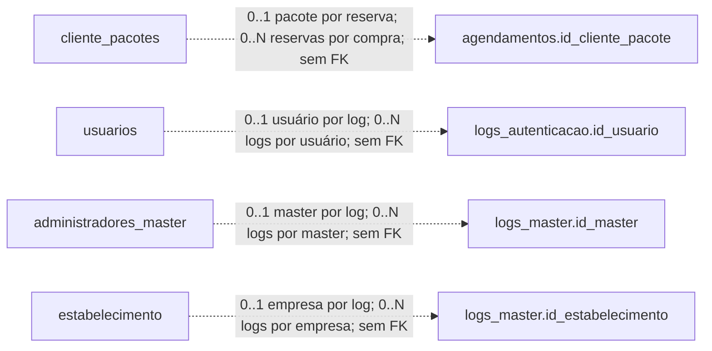

# MER e DER do Agendei

Documento gerado por `php scripts/gerar_modelo_bd.php`. A estrutura é extraída de
`banco.sql` e `banco_postgres.sql`; as regras de funcionamento foram conferidas nos
models PHP. Não é uma inspeção da base instalada. Para atualizar uma base antiga,
consulte as migrações do projeto; não execute os scripts de instalação sobre seus dados.

## Como ler

O DER completo abaixo inclui todas as tabelas. PK identifica a chave primária;
FK identifica colunas que participam de uma chave estrangeira declarada;
UK indica participação em uma restrição de unicidade, possivelmente composta.
Uma coluna marcada UK não é necessariamente única sozinha: consulte os conjuntos
no dicionário. Tipos no desenho são abreviados; tipos exatos, tamanhos, enumerações,
valores padrão, ações de exclusão e CHECKs constam nas definições SQL literais.

Na notação Mermaid, `||` = exatamente um, `o|`/`|o` = zero ou um e `o{` = zero ou
vários. A extremidade junto ao pai indica quantos pais um filho pode referenciar;
a extremidade junto ao filho indica quantos filhos um pai pode ter. Linha contínua
é relação identificadora (FK contida na PK); linha tracejada é não identificadora.
**Ambas representam FKs reais**. Vínculos sem FK aparecem apenas no diagrama lógico
separado. FKs simples reforçadas por compostas aparecem uma vez no desenho;
a listagem de restrições preserva todas elas.

## MER: entidades e funcionamento

O estabelecimento organiza usuários, catálogo, agenda e configurações. Usuários
possuem perfis de cliente, profissional ou administrador local; a conta master é
global e independente dessa especialização. O fluxo de cadastro cria o perfil
correspondente, mas o SQL permite zero ou um registro em cada subtipo e não impõe
exclusividade entre as três tabelas.

`profissional_servico` é a associação N:N entre profissionais e serviços, com PK
composta pelos dois identificadores. `cliente_pacotes` representa a aquisição de
um pacote por um cliente, com saldo e validade próprios; admite compras repetidas.
`estabelecimento_plano` guarda um único vínculo atual por empresa, não um histórico.
`assinaturas` guarda o estado comercial da empresa. Estas duas últimas tabelas
dependem da chave do estabelecimento para sua identificação. As demais tabelas
com PK própria não devem ser classificadas como fracas apenas porque possuem FK.

Horários e bloqueios sustentam o cálculo de disponibilidade. Agendamentos ligam
cliente, profissional e serviço e preservam preço e intervalo da reserva.
Espera, notificações, pagamentos, fidelidade, pacotes e avaliações complementam
esse fluxo. Logs preservam informações históricas; tentativas de acesso protegem
a autenticação. Relatórios e comissões são calculados pelo código, sem tabelas
próprias de relatório ou comissão. Os atributos de cada entidade estão no dicionário.

### Perfis e master

usuarios.tipo distingue cliente, profissional e admin da empresa. clientes, profissionais e administradores têm id_usuario único: cada usuário pode ter zero ou um registro em cada tabela. O fluxo da aplicação cria o perfil correspondente; as FKs não impõem, sozinhas, especialização total e exclusiva. administradores_master contém as contas globais e não pertence a estabelecimento.

### Isolamento das empresas

As FKs compostas incluem id_estabelecimento e o identificador do registro. Chaves únicas compostas não tornam cada coluna única isoladamente. Os vínculos id_usuario_criou e id_usuario_cancelou usam FKs simples; o DER não deve atribuir a eles uma restrição composta inexistente.

### Agenda

agendamentos relaciona exatamente um cliente, um profissional e um serviço. profissional_servico resolve quais profissionais executam quais serviços (N:N). Disponibilidade.php verifica expediente semanal, bloqueios, antecedência e conflitos. Agendamento.php também verifica conflito do cliente. Essas verificações são feitas pela aplicação, não por uma restrição SQL de sobreposição.

### Histórico da reserva

Agendamento.php copia o preço para valor e calcula hora_fim com a duração do serviço ao criar a reserva. Alterações posteriores no catálogo não recalculam essas colunas. Cancelar mantém o registro, altera o status e libera o intervalo. grupo_recorrencia agrupa reservas; não existe tabela de recorrências.

### Pacotes: vínculo sem FK

agendamentos.id_cliente_pacote é anulável e não tem FOREIGN KEY em nenhum dos dois scripts. Diferencial::usarCreditoPacote seleciona uma compra paga, válida, com saldo, do cliente, serviço e estabelecimento da reserva. A aplicação consome o crédito e grava o identificador; o cancelamento devolve o crédito e limpa o vínculo. Esta relação deve aparecer separadamente como lógica, sem marcação FK.

### Benefícios e pagamentos

cliente_pacotes registra compras de pacotes de serviços. pagamentos registra sinal ou integral por agendamento, com unicidade por estabelecimento, agendamento e tipo. fidelidade_movimentos admite no máximo um movimento por agendamento quando informado. avaliacoes admite no máximo uma avaliação por agendamento; a aplicação verifica cliente, conclusão e nota. Saldo de fidelidade fica em clientes.pontos_fidelidade.

### Espera e notificações

lista_espera exige cliente e serviço, mas permite profissional nulo (qualquer profissional). notificacoes permite usuário e agendamento nulos. As colunas canal e status representam registros e acompanhamento; não significam, por si, integração automática com provedores externos.

### Autenticação e auditoria

usuarios e administradores_master armazenam os três campos TOTP. logs_autenticacao tem FK somente para estabelecimento: id_usuario é referência histórica sem FK. logs_master não possui FKs, inclusive em id_master e id_estabelecimento; os nomes são copiados. tentativas_acesso é global e guarda escopo, chave em hash e data, sem relação por FK com contas.

### Planos e assinaturas

planos define limites de uso; estabelecimento_plano tem id_estabelecimento como PK/FK e permite zero ou um plano atual por empresa. assinaturas também tem id_estabelecimento como PK/FK e registra demonstração, solicitação e confirmação de pagamento da plataforma. Não existe FK entre assinaturas e planos nem entre assinaturas e pagamentos. Assinatura.php inicia sete dias de demonstração; empresas sem assinatura são tratadas como legadas ativas. O valor mensal é uma constante PHP, não uma coluna.

### Limites da documentação

O DER descreve os scripts SQL versionados e as regras identificadas no código. Não é uma inspeção do banco instalado: bases antigas podem exigir as migrações do projeto. MySQL/MariaDB e PostgreSQL têm tipos, índices e CHECKs próprios; o dicionário preserva as definições de cada dialeto.

## DER físico completo — MySQL/MariaDB

```mermaid
erDiagram
    estabelecimento {
        int_unsigned id_estabelecimento PK "NOT NULL"
        varchar nome "NOT NULL"
        varchar slogan "NULL"
        text descricao "NULL"
        varchar telefone "NULL"
        varchar whatsapp "NULL"
        varchar email "NULL"
        varchar endereco "NULL"
        varchar bairro "NULL"
        varchar cidade "NULL"
        char uf "NULL"
        varchar cep "NULL"
        text horario_funcionamento "NULL"
        varchar instagram "NULL"
        varchar facebook "NULL"
        datetime data_atualizacao "NULL"
        varchar slug UK "NOT NULL"
        char cor_primaria "NOT NULL"
        char cor_secundaria "NOT NULL"
        char cor_fundo "NOT NULL"
        varchar fonte "NOT NULL"
        mediumtext logo "NULL"
        enum status "NOT NULL"
    }
    assinaturas {
        int_unsigned id_estabelecimento PK,FK "NOT NULL"
        enum status "NOT NULL"
        datetime data_inicio_demo "NULL"
        datetime data_fim_demo "NULL"
        enum metodo_pagamento "NULL"
        datetime data_solicitacao "NULL"
        datetime data_pagamento "NULL"
    }
    administradores_master {
        int_unsigned id_master PK "NOT NULL"
        varchar nome "NOT NULL"
        varchar email UK "NOT NULL"
        varchar senha_hash "NOT NULL"
        enum status "NOT NULL"
        char cor_primaria "NOT NULL"
        char cor_secundaria "NOT NULL"
        char cor_fundo "NOT NULL"
        varchar fonte "NOT NULL"
        mediumtext logo "NULL"
        varchar totp_segredo "NULL"
        datetime totp_ativado_em "NULL"
        bigint totp_ultimo_contador "NULL"
        datetime ultimo_acesso "NULL"
        datetime data_criacao "NOT NULL"
        datetime data_atualizacao "NULL"
    }
    usuarios {
        int_unsigned id_usuario PK,UK "NOT NULL"
        varchar nome "NOT NULL"
        varchar email UK "NOT NULL"
        varchar senha_hash "NOT NULL"
        varchar telefone "NULL"
        varchar telefone_fixo "NULL"
        varchar login UK "NULL"
        enum sexo "NULL"
        varchar nome_materno "NULL"
        date data_nascimento "NULL"
        char cep "NULL"
        varchar logradouro "NULL"
        varchar numero "NULL"
        varchar complemento "NULL"
        varchar bairro "NULL"
        varchar cidade "NULL"
        char uf "NULL"
        enum tipo "NOT NULL"
        enum status "NOT NULL"
        varchar totp_segredo "NULL"
        datetime totp_ativado_em "NULL"
        bigint totp_ultimo_contador "NULL"
        varchar token_recuperacao "NULL"
        datetime token_expiracao "NULL"
        datetime ultimo_acesso "NULL"
        datetime data_criacao "NOT NULL"
        datetime data_atualizacao "NULL"
        int_unsigned id_estabelecimento FK,UK "NOT NULL"
    }
    clientes {
        int_unsigned id_cliente PK,UK "NOT NULL"
        int_unsigned id_usuario FK,UK "NOT NULL"
        char cpf UK "NULL"
        date data_nascimento "NULL"
        text observacoes "NULL"
        int_unsigned pontos_fidelidade "NOT NULL"
        datetime data_cadastro "NOT NULL"
        int_unsigned id_estabelecimento FK,UK "NOT NULL"
    }
    profissionais {
        int_unsigned id_profissional PK,UK "NOT NULL"
        int_unsigned id_usuario FK,UK "NOT NULL"
        varchar especialidade "NULL"
        text bio "NULL"
        varchar foto "NULL"
        tinyint pode_bloquear_agenda "NOT NULL"
        datetime data_cadastro "NOT NULL"
        decimal comissao_percentual "NOT NULL"
        char token_calendario "NULL"
        int_unsigned id_estabelecimento FK,UK "NOT NULL"
    }
    administradores {
        int_unsigned id_administrador PK,UK "NOT NULL"
        int_unsigned id_usuario FK,UK "NOT NULL"
        enum nivel "NOT NULL"
        datetime data_cadastro "NOT NULL"
        int_unsigned id_estabelecimento FK,UK "NOT NULL"
    }
    servicos {
        int_unsigned id_servico PK,UK "NOT NULL"
        varchar nome "NOT NULL"
        text descricao "NULL"
        decimal preco "NOT NULL"
        smallint_unsigned duracao_minutos "NOT NULL"
        enum status "NOT NULL"
        tinyint destaque "NOT NULL"
        datetime data_cadastro "NOT NULL"
        datetime data_atualizacao "NULL"
        int_unsigned id_estabelecimento FK,UK "NOT NULL"
    }
    profissional_servico {
        int_unsigned id_profissional PK,FK "NOT NULL"
        int_unsigned id_servico PK,FK "NOT NULL"
        int_unsigned id_estabelecimento FK "NOT NULL"
    }
    horarios_profissionais {
        int_unsigned id_horario PK,UK "NOT NULL"
        int_unsigned id_profissional FK,UK "NOT NULL"
        tinyint_unsigned dia_semana UK "NOT NULL"
        time hora_inicio UK "NOT NULL"
        time hora_fim UK "NOT NULL"
        smallint_unsigned intervalo_minutos "NOT NULL"
        enum status "NOT NULL"
        datetime data_cadastro "NOT NULL"
        int_unsigned id_estabelecimento FK,UK "NOT NULL"
    }
    bloqueios_agenda {
        int_unsigned id_bloqueio PK,UK "NOT NULL"
        int_unsigned id_profissional FK "NOT NULL"
        date data_bloqueio "NOT NULL"
        time hora_inicio "NOT NULL"
        time hora_fim "NOT NULL"
        varchar motivo "NULL"
        int_unsigned id_usuario_criou FK "NULL"
        datetime data_criacao "NOT NULL"
        int_unsigned id_estabelecimento FK,UK "NOT NULL"
    }
    agendamentos {
        int_unsigned id_agendamento PK,UK "NOT NULL"
        int_unsigned id_cliente FK "NOT NULL"
        int_unsigned id_profissional FK "NOT NULL"
        int_unsigned id_servico FK "NOT NULL"
        date data_agendamento "NOT NULL"
        time hora_inicio "NOT NULL"
        time hora_fim "NOT NULL"
        decimal valor "NOT NULL"
        enum status "NOT NULL"
        text observacao "NULL"
        enum origem "NOT NULL"
        varchar motivo_cancelamento "NULL"
        int_unsigned id_usuario_cancelou FK "NULL"
        datetime data_criacao "NOT NULL"
        datetime data_atualizacao "NULL"
        char grupo_recorrencia "NULL"
        int_unsigned id_cliente_pacote "NULL"
        int_unsigned id_estabelecimento FK,UK "NOT NULL"
    }
    lista_espera {
        int_unsigned id_lista PK "NOT NULL"
        int_unsigned id_estabelecimento FK,UK "NOT NULL"
        int_unsigned id_cliente FK,UK "NOT NULL"
        int_unsigned id_servico FK,UK "NOT NULL"
        int_unsigned id_profissional FK,UK "NULL"
        date data_desejada UK "NOT NULL"
        enum periodo "NOT NULL"
        enum status "NOT NULL"
        datetime data_aviso "NULL"
        datetime data_criacao "NOT NULL"
    }
    notificacoes {
        int_unsigned id_notificacao PK "NOT NULL"
        int_unsigned id_estabelecimento FK,UK "NOT NULL"
        int_unsigned id_usuario FK "NULL"
        int_unsigned id_agendamento FK,UK "NULL"
        enum canal "NOT NULL"
        varchar tipo UK "NOT NULL"
        varchar destinatario "NULL"
        text mensagem "NOT NULL"
        enum status "NOT NULL"
        datetime data_programada "NULL"
        datetime data_envio "NULL"
        datetime data_criacao "NOT NULL"
    }
    pagamentos {
        int_unsigned id_pagamento PK "NOT NULL"
        int_unsigned id_estabelecimento FK,UK "NOT NULL"
        int_unsigned id_agendamento FK,UK "NOT NULL"
        enum tipo UK "NOT NULL"
        decimal valor "NOT NULL"
        enum metodo "NOT NULL"
        enum status "NOT NULL"
        varchar referencia "NULL"
        datetime data_pagamento "NULL"
        datetime data_criacao "NOT NULL"
    }
    fidelidade_movimentos {
        int_unsigned id_movimento PK "NOT NULL"
        int_unsigned id_estabelecimento FK,UK "NOT NULL"
        int_unsigned id_cliente FK "NOT NULL"
        int_unsigned id_agendamento FK,UK "NULL"
        int pontos "NOT NULL"
        varchar descricao "NOT NULL"
        datetime data_criacao "NOT NULL"
    }
    pacotes {
        int_unsigned id_pacote PK,UK "NOT NULL"
        int_unsigned id_estabelecimento FK,UK "NOT NULL"
        int_unsigned id_servico FK "NOT NULL"
        varchar nome "NOT NULL"
        smallint_unsigned quantidade "NOT NULL"
        smallint_unsigned validade_dias "NOT NULL"
        decimal preco "NOT NULL"
        enum status "NOT NULL"
        datetime data_criacao "NOT NULL"
    }
    cliente_pacotes {
        int_unsigned id_cliente_pacote PK,UK "NOT NULL"
        int_unsigned id_estabelecimento FK,UK "NOT NULL"
        int_unsigned id_cliente FK "NOT NULL"
        int_unsigned id_pacote FK "NOT NULL"
        smallint_unsigned creditos_total "NOT NULL"
        smallint_unsigned creditos_restantes "NOT NULL"
        enum status_pagamento "NOT NULL"
        date data_expiracao "NOT NULL"
        datetime data_criacao "NOT NULL"
    }
    avaliacoes {
        int_unsigned id_avaliacao PK "NOT NULL"
        int_unsigned id_estabelecimento FK,UK "NOT NULL"
        int_unsigned id_agendamento FK,UK "NOT NULL"
        int_unsigned id_cliente FK "NOT NULL"
        int_unsigned id_profissional FK "NOT NULL"
        tinyint_unsigned nota "NOT NULL"
        varchar comentario "NULL"
        enum status "NOT NULL"
        datetime data_criacao "NOT NULL"
    }
    logs_autenticacao {
        int_unsigned id_log PK "NOT NULL"
        int_unsigned id_estabelecimento FK "NOT NULL"
        int_unsigned id_usuario "NULL"
        varchar login_informado "NOT NULL"
        varchar nome "NOT NULL"
        char cpf "NULL"
        varchar perfil "NULL"
        enum evento "NOT NULL"
        enum fator_2fa "NULL"
        varchar ip "NULL"
        datetime data_hora "NOT NULL"
    }
    planos {
        int_unsigned id_plano PK "NOT NULL"
        varchar nome UK "NOT NULL"
        varchar descricao "NULL"
        int_unsigned limite_profissionais "NULL"
        int_unsigned limite_servicos "NULL"
        int_unsigned limite_agendamentos_mes "NULL"
        enum status "NOT NULL"
        datetime data_criacao "NOT NULL"
    }
    estabelecimento_plano {
        int_unsigned id_estabelecimento PK,FK "NOT NULL"
        int_unsigned id_plano FK "NOT NULL"
        datetime data_inicio "NOT NULL"
        varchar observacao "NULL"
    }
    logs_master {
        bigint_unsigned id_log_master PK "NOT NULL"
        int_unsigned id_master "NULL"
        varchar master_nome "NOT NULL"
        varchar master_email "NOT NULL"
        varchar acao "NOT NULL"
        int_unsigned id_estabelecimento "NULL"
        varchar estabelecimento_nome "NULL"
        varchar alvo "NULL"
        varchar detalhe "NULL"
        varchar ip "NULL"
        datetime data_hora "NOT NULL"
    }
    tentativas_acesso {
        bigint_unsigned id_tentativa PK "NOT NULL"
        varchar escopo "NOT NULL"
        char chave "NOT NULL"
        datetime data_hora "NOT NULL"
    }
    configuracoes {
        int_unsigned id_configuracao PK,UK "NOT NULL"
        varchar chave UK "NOT NULL"
        varchar valor "NOT NULL"
        varchar descricao "NULL"
        int_unsigned id_estabelecimento FK,UK "NOT NULL"
    }
    estabelecimento ||--o| assinaturas : "id_estabelecimento"
    estabelecimento ||..o{ usuarios : "id_estabelecimento"
    estabelecimento ||..o{ clientes : "id_estabelecimento"
    usuarios ||..o| clientes : "id_estabelecimento + id_usuario"
    estabelecimento ||..o{ profissionais : "id_estabelecimento"
    usuarios ||..o| profissionais : "id_estabelecimento + id_usuario"
    estabelecimento ||..o{ administradores : "id_estabelecimento"
    usuarios ||..o| administradores : "id_estabelecimento + id_usuario"
    estabelecimento ||..o{ servicos : "id_estabelecimento"
    estabelecimento ||..o{ profissional_servico : "id_estabelecimento"
    profissionais ||..o{ profissional_servico : "id_estabelecimento + id_profissional"
    servicos ||..o{ profissional_servico : "id_estabelecimento + id_servico"
    estabelecimento ||..o{ horarios_profissionais : "id_estabelecimento"
    profissionais ||..o{ horarios_profissionais : "id_estabelecimento + id_profissional"
    estabelecimento ||..o{ bloqueios_agenda : "id_estabelecimento"
    usuarios |o..o{ bloqueios_agenda : "id_usuario_criou"
    profissionais ||..o{ bloqueios_agenda : "id_estabelecimento + id_profissional"
    usuarios |o..o{ agendamentos : "id_usuario_cancelou"
    estabelecimento ||..o{ agendamentos : "id_estabelecimento"
    clientes ||..o{ agendamentos : "id_estabelecimento + id_cliente"
    profissionais ||..o{ agendamentos : "id_estabelecimento + id_profissional"
    servicos ||..o{ agendamentos : "id_estabelecimento + id_servico"
    estabelecimento ||..o{ lista_espera : "id_estabelecimento"
    clientes ||..o{ lista_espera : "id_estabelecimento + id_cliente"
    servicos ||..o{ lista_espera : "id_estabelecimento + id_servico"
    profissionais |o..o{ lista_espera : "id_estabelecimento + id_profissional"
    estabelecimento ||..o{ notificacoes : "id_estabelecimento"
    usuarios |o..o{ notificacoes : "id_estabelecimento + id_usuario"
    agendamentos |o..o{ notificacoes : "id_estabelecimento + id_agendamento"
    estabelecimento ||..o{ pagamentos : "id_estabelecimento"
    agendamentos ||..o{ pagamentos : "id_estabelecimento + id_agendamento"
    estabelecimento ||..o{ fidelidade_movimentos : "id_estabelecimento"
    clientes ||..o{ fidelidade_movimentos : "id_estabelecimento + id_cliente"
    agendamentos |o..o| fidelidade_movimentos : "id_estabelecimento + id_agendamento"
    estabelecimento ||..o{ pacotes : "id_estabelecimento"
    servicos ||..o{ pacotes : "id_estabelecimento + id_servico"
    estabelecimento ||..o{ cliente_pacotes : "id_estabelecimento"
    clientes ||..o{ cliente_pacotes : "id_estabelecimento + id_cliente"
    pacotes ||..o{ cliente_pacotes : "id_estabelecimento + id_pacote"
    estabelecimento ||..o{ avaliacoes : "id_estabelecimento"
    agendamentos ||..o| avaliacoes : "id_estabelecimento + id_agendamento"
    clientes ||..o{ avaliacoes : "id_estabelecimento + id_cliente"
    profissionais ||..o{ avaliacoes : "id_estabelecimento + id_profissional"
    estabelecimento ||..o{ logs_autenticacao : "id_estabelecimento"
    estabelecimento ||--o| estabelecimento_plano : "id_estabelecimento"
    planos ||..o{ estabelecimento_plano : "id_plano"
    estabelecimento ||..o{ configuracoes : "id_estabelecimento"
```



## Referências lógicas sem FOREIGN KEY

Este desenho não adiciona restrições ao banco. Os identificadores históricos podem
permanecer após a exclusão do registro original; não há garantia de integridade
referencial nem de existência atual do pai. A cardinalidade mostra o uso esperado
do identificador pela aplicação.



## Dicionário e restrições — MySQL/MariaDB

25 tabelas; 57 chaves estrangeiras declaradas.

### `estabelecimento`

| Coluna | Tipo SQL | Nulo | Chaves |
|---|---|---|---|
| `id_estabelecimento` | `int(10) unsigned` | Não | PK |
| `nome` | `varchar(120)` | Não | — |
| `slogan` | `varchar(180)` | Sim | — |
| `descricao` | `text` | Sim | — |
| `telefone` | `varchar(20)` | Sim | — |
| `whatsapp` | `varchar(20)` | Sim | — |
| `email` | `varchar(150)` | Sim | — |
| `endereco` | `varchar(180)` | Sim | — |
| `bairro` | `varchar(100)` | Sim | — |
| `cidade` | `varchar(100)` | Sim | — |
| `uf` | `char(2)` | Sim | — |
| `cep` | `varchar(9)` | Sim | — |
| `horario_funcionamento` | `text` | Sim | — |
| `instagram` | `varchar(120)` | Sim | — |
| `facebook` | `varchar(120)` | Sim | — |
| `data_atualizacao` | `datetime` | Sim | — |
| `slug` | `varchar(80)` | Não | UK |
| `cor_primaria` | `char(7)` | Não | — |
| `cor_secundaria` | `char(7)` | Não | — |
| `cor_fundo` | `char(7)` | Não | — |
| `fonte` | `varchar(30)` | Não | — |
| `logo` | `mediumtext` | Sim | — |
| `status` | `enum('ativo','inativo')` | Não | — |

Definição literal (inclui defaults, chaves compostas e CHECKs):

```sql
CREATE TABLE `estabelecimento` (
  `id_estabelecimento` int(10) unsigned NOT NULL AUTO_INCREMENT,
  `nome` varchar(120) NOT NULL,
  `slogan` varchar(180) DEFAULT NULL,
  `descricao` text DEFAULT NULL,
  `telefone` varchar(20) DEFAULT NULL,
  `whatsapp` varchar(20) DEFAULT NULL,
  `email` varchar(150) DEFAULT NULL,
  `endereco` varchar(180) DEFAULT NULL,
  `bairro` varchar(100) DEFAULT NULL,
  `cidade` varchar(100) DEFAULT NULL,
  `uf` char(2) DEFAULT NULL,
  `cep` varchar(9) DEFAULT NULL,
  `horario_funcionamento` text DEFAULT NULL,
  `instagram` varchar(120) DEFAULT NULL,
  `facebook` varchar(120) DEFAULT NULL,
  `data_atualizacao` datetime DEFAULT NULL ON UPDATE current_timestamp(),
  `slug` varchar(80) NOT NULL,
  `cor_primaria` char(7) NOT NULL DEFAULT '#1F4E5F',
  `cor_secundaria` char(7) NOT NULL DEFAULT '#5FAF8B',
  `cor_fundo` char(7) NOT NULL DEFAULT '#F5F1EA',
  `fonte` varchar(30) NOT NULL DEFAULT 'padrao',
  `logo` mediumtext DEFAULT NULL,
  `status` enum('ativo','inativo') NOT NULL DEFAULT 'ativo',
  PRIMARY KEY (`id_estabelecimento`),
  UNIQUE KEY `uk_estabelecimento_slug` (`slug`)
) ENGINE=InnoDB DEFAULT CHARSET=utf8mb4 COLLATE=utf8mb4_unicode_ci;
```

### `assinaturas`

| Coluna | Tipo SQL | Nulo | Chaves |
|---|---|---|---|
| `id_estabelecimento` | `int(10) unsigned` | Não | PK, FK |
| `status` | `enum('demo','pendente','ativa','bloqueada')` | Não | — |
| `data_inicio_demo` | `datetime` | Sim | — |
| `data_fim_demo` | `datetime` | Sim | — |
| `metodo_pagamento` | `enum('pix','boleto','cartao')` | Sim | — |
| `data_solicitacao` | `datetime` | Sim | — |
| `data_pagamento` | `datetime` | Sim | — |

Definição literal (inclui defaults, chaves compostas e CHECKs):

```sql
CREATE TABLE `assinaturas` (
  `id_estabelecimento` int(10) unsigned NOT NULL,
  `status` enum('demo','pendente','ativa','bloqueada') NOT NULL DEFAULT 'ativa',
  `data_inicio_demo` datetime DEFAULT NULL,
  `data_fim_demo` datetime DEFAULT NULL,
  `metodo_pagamento` enum('pix','boleto','cartao') DEFAULT NULL,
  `data_solicitacao` datetime DEFAULT NULL,
  `data_pagamento` datetime DEFAULT NULL,
  PRIMARY KEY (`id_estabelecimento`),
  CONSTRAINT `fk_assinaturas_estabelecimento` FOREIGN KEY (`id_estabelecimento`) REFERENCES `estabelecimento` (`id_estabelecimento`) ON DELETE CASCADE
) ENGINE=InnoDB DEFAULT CHARSET=utf8mb4 COLLATE=utf8mb4_unicode_ci;
```

### `administradores_master`

| Coluna | Tipo SQL | Nulo | Chaves |
|---|---|---|---|
| `id_master` | `int(10) unsigned` | Não | PK |
| `nome` | `varchar(120)` | Não | — |
| `email` | `varchar(150)` | Não | UK |
| `senha_hash` | `varchar(255)` | Não | — |
| `status` | `enum('ativo','inativo')` | Não | — |
| `cor_primaria` | `char(7)` | Não | — |
| `cor_secundaria` | `char(7)` | Não | — |
| `cor_fundo` | `char(7)` | Não | — |
| `fonte` | `varchar(30)` | Não | — |
| `logo` | `mediumtext` | Sim | — |
| `totp_segredo` | `varchar(255)` | Sim | — |
| `totp_ativado_em` | `datetime` | Sim | — |
| `totp_ultimo_contador` | `bigint(20)` | Sim | — |
| `ultimo_acesso` | `datetime` | Sim | — |
| `data_criacao` | `datetime` | Não | — |
| `data_atualizacao` | `datetime` | Sim | — |

Definição literal (inclui defaults, chaves compostas e CHECKs):

```sql
CREATE TABLE `administradores_master` (
  `id_master` int(10) unsigned NOT NULL AUTO_INCREMENT,
  `nome` varchar(120) NOT NULL,
  `email` varchar(150) NOT NULL,
  `senha_hash` varchar(255) NOT NULL,
  `status` enum('ativo','inativo') NOT NULL DEFAULT 'ativo',
  `cor_primaria` char(7) NOT NULL DEFAULT '#252B36',
  `cor_secundaria` char(7) NOT NULL DEFAULT '#6E8BFF',
  `cor_fundo` char(7) NOT NULL DEFAULT '#F3F5F8',
  `fonte` varchar(30) NOT NULL DEFAULT 'padrao',
  `logo` mediumtext DEFAULT NULL,
  `totp_segredo` varchar(255) DEFAULT NULL,
  `totp_ativado_em` datetime DEFAULT NULL,
  `totp_ultimo_contador` bigint(20) DEFAULT NULL,
  `ultimo_acesso` datetime DEFAULT NULL,
  `data_criacao` datetime NOT NULL DEFAULT current_timestamp(),
  `data_atualizacao` datetime DEFAULT NULL ON UPDATE current_timestamp(),
  PRIMARY KEY (`id_master`),
  UNIQUE KEY `uk_master_email` (`email`)
) ENGINE=InnoDB DEFAULT CHARSET=utf8mb4 COLLATE=utf8mb4_unicode_ci;
```

### `usuarios`

| Coluna | Tipo SQL | Nulo | Chaves |
|---|---|---|---|
| `id_usuario` | `int(10) unsigned` | Não | PK, UK |
| `nome` | `varchar(120)` | Não | — |
| `email` | `varchar(150)` | Não | UK |
| `senha_hash` | `varchar(255)` | Não | — |
| `telefone` | `varchar(20)` | Sim | — |
| `telefone_fixo` | `varchar(20)` | Sim | — |
| `login` | `varchar(6)` | Sim | UK |
| `sexo` | `enum('F','M','O')` | Sim | — |
| `nome_materno` | `varchar(120)` | Sim | — |
| `data_nascimento` | `date` | Sim | — |
| `cep` | `char(8)` | Sim | — |
| `logradouro` | `varchar(150)` | Sim | — |
| `numero` | `varchar(20)` | Sim | — |
| `complemento` | `varchar(60)` | Sim | — |
| `bairro` | `varchar(100)` | Sim | — |
| `cidade` | `varchar(100)` | Sim | — |
| `uf` | `char(2)` | Sim | — |
| `tipo` | `enum('cliente','profissional','admin')` | Não | — |
| `status` | `enum('ativo','inativo')` | Não | — |
| `totp_segredo` | `varchar(255)` | Sim | — |
| `totp_ativado_em` | `datetime` | Sim | — |
| `totp_ultimo_contador` | `bigint(20)` | Sim | — |
| `token_recuperacao` | `varchar(64)` | Sim | — |
| `token_expiracao` | `datetime` | Sim | — |
| `ultimo_acesso` | `datetime` | Sim | — |
| `data_criacao` | `datetime` | Não | — |
| `data_atualizacao` | `datetime` | Sim | — |
| `id_estabelecimento` | `int(10) unsigned` | Não | FK, UK |

Definição literal (inclui defaults, chaves compostas e CHECKs):

```sql
CREATE TABLE `usuarios` (
  `id_usuario` int(10) unsigned NOT NULL AUTO_INCREMENT,
  `nome` varchar(120) NOT NULL,
  `email` varchar(150) NOT NULL,
  `senha_hash` varchar(255) NOT NULL,
  `telefone` varchar(20) DEFAULT NULL,
  `telefone_fixo` varchar(20) DEFAULT NULL,
  `login` varchar(6) DEFAULT NULL,
  `sexo` enum('F','M','O') DEFAULT NULL,
  `nome_materno` varchar(120) DEFAULT NULL,
  `data_nascimento` date DEFAULT NULL,
  `cep` char(8) DEFAULT NULL,
  `logradouro` varchar(150) DEFAULT NULL,
  `numero` varchar(20) DEFAULT NULL,
  `complemento` varchar(60) DEFAULT NULL,
  `bairro` varchar(100) DEFAULT NULL,
  `cidade` varchar(100) DEFAULT NULL,
  `uf` char(2) DEFAULT NULL,
  `tipo` enum('cliente','profissional','admin') NOT NULL DEFAULT 'cliente',
  `status` enum('ativo','inativo') NOT NULL DEFAULT 'ativo',
  `totp_segredo` varchar(255) DEFAULT NULL,
  `totp_ativado_em` datetime DEFAULT NULL,
  `totp_ultimo_contador` bigint(20) DEFAULT NULL,
  `token_recuperacao` varchar(64) DEFAULT NULL,
  `token_expiracao` datetime DEFAULT NULL,
  `ultimo_acesso` datetime DEFAULT NULL,
  `data_criacao` datetime NOT NULL DEFAULT current_timestamp(),
  `data_atualizacao` datetime DEFAULT NULL ON UPDATE current_timestamp(),
  `id_estabelecimento` int(10) unsigned NOT NULL,
  PRIMARY KEY (`id_usuario`),
  UNIQUE KEY `uk_estabelecimento_registro` (`id_estabelecimento`,`id_usuario`),
  UNIQUE KEY `uk_estabelecimento_email` (`id_estabelecimento`,`email`),
  UNIQUE KEY `uk_estabelecimento_login` (`id_estabelecimento`,`login`),
  KEY `idx_usuarios_tipo_status` (`tipo`,`status`),
  KEY `idx_estabelecimento` (`id_estabelecimento`),
  CONSTRAINT `fk_usuarios_estabelecimento` FOREIGN KEY (`id_estabelecimento`) REFERENCES `estabelecimento` (`id_estabelecimento`)
) ENGINE=InnoDB DEFAULT CHARSET=utf8mb4 COLLATE=utf8mb4_unicode_ci;
```

### `clientes`

| Coluna | Tipo SQL | Nulo | Chaves |
|---|---|---|---|
| `id_cliente` | `int(10) unsigned` | Não | PK, UK |
| `id_usuario` | `int(10) unsigned` | Não | FK, UK |
| `cpf` | `char(11)` | Sim | UK |
| `data_nascimento` | `date` | Sim | — |
| `observacoes` | `text` | Sim | — |
| `pontos_fidelidade` | `int(10) unsigned` | Não | — |
| `data_cadastro` | `datetime` | Não | — |
| `id_estabelecimento` | `int(10) unsigned` | Não | FK, UK |

Definição literal (inclui defaults, chaves compostas e CHECKs):

```sql
CREATE TABLE `clientes` (
  `id_cliente` int(10) unsigned NOT NULL AUTO_INCREMENT,
  `id_usuario` int(10) unsigned NOT NULL,
  `cpf` char(11) DEFAULT NULL,
  `data_nascimento` date DEFAULT NULL,
  `observacoes` text DEFAULT NULL,
  `pontos_fidelidade` int(10) unsigned NOT NULL DEFAULT 0,
  `data_cadastro` datetime NOT NULL DEFAULT current_timestamp(),
  `id_estabelecimento` int(10) unsigned NOT NULL,
  PRIMARY KEY (`id_cliente`),
  UNIQUE KEY `uk_clientes_usuario` (`id_usuario`),
  UNIQUE KEY `uk_estabelecimento_registro` (`id_estabelecimento`,`id_cliente`),
  UNIQUE KEY `uk_estabelecimento_cpf` (`id_estabelecimento`,`cpf`),
  KEY `idx_estabelecimento` (`id_estabelecimento`),
  KEY `fk_tenant_clientes_id_usuario` (`id_estabelecimento`,`id_usuario`),
  CONSTRAINT `fk_clientes_estabelecimento` FOREIGN KEY (`id_estabelecimento`) REFERENCES `estabelecimento` (`id_estabelecimento`),
  CONSTRAINT `fk_clientes_usuario` FOREIGN KEY (`id_usuario`) REFERENCES `usuarios` (`id_usuario`) ON DELETE CASCADE ON UPDATE CASCADE,
  CONSTRAINT `fk_tenant_clientes_id_usuario` FOREIGN KEY (`id_estabelecimento`, `id_usuario`) REFERENCES `usuarios` (`id_estabelecimento`, `id_usuario`) ON DELETE CASCADE ON UPDATE CASCADE
) ENGINE=InnoDB DEFAULT CHARSET=utf8mb4 COLLATE=utf8mb4_unicode_ci;
```

### `profissionais`

| Coluna | Tipo SQL | Nulo | Chaves |
|---|---|---|---|
| `id_profissional` | `int(10) unsigned` | Não | PK, UK |
| `id_usuario` | `int(10) unsigned` | Não | FK, UK |
| `especialidade` | `varchar(120)` | Sim | — |
| `bio` | `text` | Sim | — |
| `foto` | `varchar(255)` | Sim | — |
| `pode_bloquear_agenda` | `tinyint(1)` | Não | — |
| `data_cadastro` | `datetime` | Não | — |
| `comissao_percentual` | `decimal(5,2)` | Não | — |
| `token_calendario` | `char(64)` | Sim | — |
| `id_estabelecimento` | `int(10) unsigned` | Não | FK, UK |

Definição literal (inclui defaults, chaves compostas e CHECKs):

```sql
CREATE TABLE `profissionais` (
  `id_profissional` int(10) unsigned NOT NULL AUTO_INCREMENT,
  `id_usuario` int(10) unsigned NOT NULL,
  `especialidade` varchar(120) DEFAULT NULL,
  `bio` text DEFAULT NULL,
  `foto` varchar(255) DEFAULT NULL,
  `pode_bloquear_agenda` tinyint(1) NOT NULL DEFAULT 1,
  `data_cadastro` datetime NOT NULL DEFAULT current_timestamp(),
  `comissao_percentual` decimal(5,2) NOT NULL DEFAULT 0.00,
  `token_calendario` char(64) DEFAULT NULL,
  `id_estabelecimento` int(10) unsigned NOT NULL,
  PRIMARY KEY (`id_profissional`),
  UNIQUE KEY `uk_profissionais_usuario` (`id_usuario`),
  UNIQUE KEY `uk_estabelecimento_registro` (`id_estabelecimento`,`id_profissional`),
  KEY `idx_estabelecimento` (`id_estabelecimento`),
  KEY `fk_tenant_profissionais_id_usuario` (`id_estabelecimento`,`id_usuario`),
  CONSTRAINT `fk_profissionais_estabelecimento` FOREIGN KEY (`id_estabelecimento`) REFERENCES `estabelecimento` (`id_estabelecimento`),
  CONSTRAINT `fk_profissionais_usuario` FOREIGN KEY (`id_usuario`) REFERENCES `usuarios` (`id_usuario`) ON DELETE CASCADE ON UPDATE CASCADE,
  CONSTRAINT `fk_tenant_profissionais_id_usuario` FOREIGN KEY (`id_estabelecimento`, `id_usuario`) REFERENCES `usuarios` (`id_estabelecimento`, `id_usuario`) ON DELETE CASCADE ON UPDATE CASCADE
) ENGINE=InnoDB DEFAULT CHARSET=utf8mb4 COLLATE=utf8mb4_unicode_ci;
```

### `administradores`

| Coluna | Tipo SQL | Nulo | Chaves |
|---|---|---|---|
| `id_administrador` | `int(10) unsigned` | Não | PK, UK |
| `id_usuario` | `int(10) unsigned` | Não | FK, UK |
| `nivel` | `enum('super','gerente')` | Não | — |
| `data_cadastro` | `datetime` | Não | — |
| `id_estabelecimento` | `int(10) unsigned` | Não | FK, UK |

Definição literal (inclui defaults, chaves compostas e CHECKs):

```sql
CREATE TABLE `administradores` (
  `id_administrador` int(10) unsigned NOT NULL AUTO_INCREMENT,
  `id_usuario` int(10) unsigned NOT NULL,
  `nivel` enum('super','gerente') NOT NULL DEFAULT 'super',
  `data_cadastro` datetime NOT NULL DEFAULT current_timestamp(),
  `id_estabelecimento` int(10) unsigned NOT NULL,
  PRIMARY KEY (`id_administrador`),
  UNIQUE KEY `uk_administradores_usuario` (`id_usuario`),
  UNIQUE KEY `uk_estabelecimento_registro` (`id_estabelecimento`,`id_administrador`),
  KEY `idx_estabelecimento` (`id_estabelecimento`),
  KEY `fk_tenant_administradores_id_usuario` (`id_estabelecimento`,`id_usuario`),
  CONSTRAINT `fk_administradores_estabelecimento` FOREIGN KEY (`id_estabelecimento`) REFERENCES `estabelecimento` (`id_estabelecimento`),
  CONSTRAINT `fk_administradores_usuario` FOREIGN KEY (`id_usuario`) REFERENCES `usuarios` (`id_usuario`) ON DELETE CASCADE ON UPDATE CASCADE,
  CONSTRAINT `fk_tenant_administradores_id_usuario` FOREIGN KEY (`id_estabelecimento`, `id_usuario`) REFERENCES `usuarios` (`id_estabelecimento`, `id_usuario`) ON DELETE CASCADE ON UPDATE CASCADE
) ENGINE=InnoDB DEFAULT CHARSET=utf8mb4 COLLATE=utf8mb4_unicode_ci;
```

### `servicos`

| Coluna | Tipo SQL | Nulo | Chaves |
|---|---|---|---|
| `id_servico` | `int(10) unsigned` | Não | PK, UK |
| `nome` | `varchar(120)` | Não | — |
| `descricao` | `text` | Sim | — |
| `preco` | `decimal(10,2)` | Não | — |
| `duracao_minutos` | `smallint(5) unsigned` | Não | — |
| `status` | `enum('ativo','inativo')` | Não | — |
| `destaque` | `tinyint(1)` | Não | — |
| `data_cadastro` | `datetime` | Não | — |
| `data_atualizacao` | `datetime` | Sim | — |
| `id_estabelecimento` | `int(10) unsigned` | Não | FK, UK |

Definição literal (inclui defaults, chaves compostas e CHECKs):

```sql
CREATE TABLE `servicos` (
  `id_servico` int(10) unsigned NOT NULL AUTO_INCREMENT,
  `nome` varchar(120) NOT NULL,
  `descricao` text DEFAULT NULL,
  `preco` decimal(10,2) NOT NULL DEFAULT 0.00,
  `duracao_minutos` smallint(5) unsigned NOT NULL DEFAULT 30,
  `status` enum('ativo','inativo') NOT NULL DEFAULT 'ativo',
  `destaque` tinyint(1) NOT NULL DEFAULT 0,
  `data_cadastro` datetime NOT NULL DEFAULT current_timestamp(),
  `data_atualizacao` datetime DEFAULT NULL ON UPDATE current_timestamp(),
  `id_estabelecimento` int(10) unsigned NOT NULL,
  PRIMARY KEY (`id_servico`),
  UNIQUE KEY `uk_estabelecimento_registro` (`id_estabelecimento`,`id_servico`),
  KEY `idx_servicos_status` (`status`),
  KEY `idx_estabelecimento` (`id_estabelecimento`),
  CONSTRAINT `fk_servicos_estabelecimento` FOREIGN KEY (`id_estabelecimento`) REFERENCES `estabelecimento` (`id_estabelecimento`),
  CONSTRAINT `ck_servicos_duracao` CHECK (`duracao_minutos` > 0),
  CONSTRAINT `ck_servicos_preco` CHECK (`preco` >= 0)
) ENGINE=InnoDB DEFAULT CHARSET=utf8mb4 COLLATE=utf8mb4_unicode_ci;
```

### `profissional_servico`

| Coluna | Tipo SQL | Nulo | Chaves |
|---|---|---|---|
| `id_profissional` | `int(10) unsigned` | Não | PK, FK |
| `id_servico` | `int(10) unsigned` | Não | PK, FK |
| `id_estabelecimento` | `int(10) unsigned` | Não | FK |

Definição literal (inclui defaults, chaves compostas e CHECKs):

```sql
CREATE TABLE `profissional_servico` (
  `id_profissional` int(10) unsigned NOT NULL,
  `id_servico` int(10) unsigned NOT NULL,
  `id_estabelecimento` int(10) unsigned NOT NULL,
  PRIMARY KEY (`id_profissional`,`id_servico`),
  KEY `idx_ps_servico` (`id_servico`),
  KEY `idx_estabelecimento` (`id_estabelecimento`),
  KEY `fk_tenant_profissional_servico_id_profissional` (`id_estabelecimento`,`id_profissional`),
  KEY `fk_tenant_profissional_servico_id_servico` (`id_estabelecimento`,`id_servico`),
  CONSTRAINT `fk_profissional_servico_estabelecimento` FOREIGN KEY (`id_estabelecimento`) REFERENCES `estabelecimento` (`id_estabelecimento`),
  CONSTRAINT `fk_ps_profissional` FOREIGN KEY (`id_profissional`) REFERENCES `profissionais` (`id_profissional`) ON DELETE CASCADE ON UPDATE CASCADE,
  CONSTRAINT `fk_ps_servico` FOREIGN KEY (`id_servico`) REFERENCES `servicos` (`id_servico`) ON DELETE CASCADE ON UPDATE CASCADE,
  CONSTRAINT `fk_tenant_profissional_servico_id_profissional` FOREIGN KEY (`id_estabelecimento`, `id_profissional`) REFERENCES `profissionais` (`id_estabelecimento`, `id_profissional`) ON DELETE CASCADE ON UPDATE CASCADE,
  CONSTRAINT `fk_tenant_profissional_servico_id_servico` FOREIGN KEY (`id_estabelecimento`, `id_servico`) REFERENCES `servicos` (`id_estabelecimento`, `id_servico`) ON DELETE CASCADE ON UPDATE CASCADE
) ENGINE=InnoDB DEFAULT CHARSET=utf8mb4 COLLATE=utf8mb4_unicode_ci;
```

### `horarios_profissionais`

| Coluna | Tipo SQL | Nulo | Chaves |
|---|---|---|---|
| `id_horario` | `int(10) unsigned` | Não | PK, UK |
| `id_profissional` | `int(10) unsigned` | Não | FK, UK |
| `dia_semana` | `tinyint(3) unsigned` | Não | UK |
| `hora_inicio` | `time` | Não | UK |
| `hora_fim` | `time` | Não | UK |
| `intervalo_minutos` | `smallint(5) unsigned` | Não | — |
| `status` | `enum('ativo','inativo')` | Não | — |
| `data_cadastro` | `datetime` | Não | — |
| `id_estabelecimento` | `int(10) unsigned` | Não | FK, UK |

Definição literal (inclui defaults, chaves compostas e CHECKs):

```sql
CREATE TABLE `horarios_profissionais` (
  `id_horario` int(10) unsigned NOT NULL AUTO_INCREMENT,
  `id_profissional` int(10) unsigned NOT NULL,
  `dia_semana` tinyint(3) unsigned NOT NULL,
  `hora_inicio` time NOT NULL,
  `hora_fim` time NOT NULL,
  `intervalo_minutos` smallint(5) unsigned NOT NULL DEFAULT 30,
  `status` enum('ativo','inativo') NOT NULL DEFAULT 'ativo',
  `data_cadastro` datetime NOT NULL DEFAULT current_timestamp(),
  `id_estabelecimento` int(10) unsigned NOT NULL,
  PRIMARY KEY (`id_horario`),
  UNIQUE KEY `uk_horario_faixa` (`id_profissional`,`dia_semana`,`hora_inicio`,`hora_fim`),
  UNIQUE KEY `uk_estabelecimento_registro` (`id_estabelecimento`,`id_horario`),
  KEY `idx_horario_prof_dia` (`id_profissional`,`dia_semana`,`status`),
  KEY `idx_estabelecimento` (`id_estabelecimento`),
  KEY `fk_tenant_horarios_profissionais_id_profissional` (`id_estabelecimento`,`id_profissional`),
  CONSTRAINT `fk_horarios_profissionais_estabelecimento` FOREIGN KEY (`id_estabelecimento`) REFERENCES `estabelecimento` (`id_estabelecimento`),
  CONSTRAINT `fk_horarios_profissional` FOREIGN KEY (`id_profissional`) REFERENCES `profissionais` (`id_profissional`) ON DELETE CASCADE ON UPDATE CASCADE,
  CONSTRAINT `fk_tenant_horarios_profissionais_id_profissional` FOREIGN KEY (`id_estabelecimento`, `id_profissional`) REFERENCES `profissionais` (`id_estabelecimento`, `id_profissional`) ON DELETE CASCADE ON UPDATE CASCADE,
  CONSTRAINT `ck_horarios_dia` CHECK (`dia_semana` between 0 and 6),
  CONSTRAINT `ck_horarios_faixa` CHECK (`hora_fim` > `hora_inicio`)
) ENGINE=InnoDB DEFAULT CHARSET=utf8mb4 COLLATE=utf8mb4_unicode_ci;
```

### `bloqueios_agenda`

| Coluna | Tipo SQL | Nulo | Chaves |
|---|---|---|---|
| `id_bloqueio` | `int(10) unsigned` | Não | PK, UK |
| `id_profissional` | `int(10) unsigned` | Não | FK |
| `data_bloqueio` | `date` | Não | — |
| `hora_inicio` | `time` | Não | — |
| `hora_fim` | `time` | Não | — |
| `motivo` | `varchar(255)` | Sim | — |
| `id_usuario_criou` | `int(10) unsigned` | Sim | FK |
| `data_criacao` | `datetime` | Não | — |
| `id_estabelecimento` | `int(10) unsigned` | Não | FK, UK |

Definição literal (inclui defaults, chaves compostas e CHECKs):

```sql
CREATE TABLE `bloqueios_agenda` (
  `id_bloqueio` int(10) unsigned NOT NULL AUTO_INCREMENT,
  `id_profissional` int(10) unsigned NOT NULL,
  `data_bloqueio` date NOT NULL,
  `hora_inicio` time NOT NULL DEFAULT '00:00:00',
  `hora_fim` time NOT NULL DEFAULT '23:59:59',
  `motivo` varchar(255) DEFAULT NULL,
  `id_usuario_criou` int(10) unsigned DEFAULT NULL,
  `data_criacao` datetime NOT NULL DEFAULT current_timestamp(),
  `id_estabelecimento` int(10) unsigned NOT NULL,
  PRIMARY KEY (`id_bloqueio`),
  UNIQUE KEY `uk_estabelecimento_registro` (`id_estabelecimento`,`id_bloqueio`),
  KEY `idx_bloqueio_prof_data` (`id_profissional`,`data_bloqueio`),
  KEY `fk_bloqueios_usuario` (`id_usuario_criou`),
  KEY `idx_estabelecimento` (`id_estabelecimento`),
  KEY `fk_tenant_bloqueios_agenda_id_profissional` (`id_estabelecimento`,`id_profissional`),
  CONSTRAINT `fk_bloqueios_agenda_estabelecimento` FOREIGN KEY (`id_estabelecimento`) REFERENCES `estabelecimento` (`id_estabelecimento`),
  CONSTRAINT `fk_bloqueios_profissional` FOREIGN KEY (`id_profissional`) REFERENCES `profissionais` (`id_profissional`) ON DELETE CASCADE ON UPDATE CASCADE,
  CONSTRAINT `fk_bloqueios_usuario` FOREIGN KEY (`id_usuario_criou`) REFERENCES `usuarios` (`id_usuario`) ON DELETE SET NULL ON UPDATE CASCADE,
  CONSTRAINT `fk_tenant_bloqueios_agenda_id_profissional` FOREIGN KEY (`id_estabelecimento`, `id_profissional`) REFERENCES `profissionais` (`id_estabelecimento`, `id_profissional`) ON DELETE CASCADE ON UPDATE CASCADE,
  CONSTRAINT `ck_bloqueio_faixa` CHECK (`hora_fim` > `hora_inicio`)
) ENGINE=InnoDB DEFAULT CHARSET=utf8mb4 COLLATE=utf8mb4_unicode_ci;
```

### `agendamentos`

| Coluna | Tipo SQL | Nulo | Chaves |
|---|---|---|---|
| `id_agendamento` | `int(10) unsigned` | Não | PK, UK |
| `id_cliente` | `int(10) unsigned` | Não | FK |
| `id_profissional` | `int(10) unsigned` | Não | FK |
| `id_servico` | `int(10) unsigned` | Não | FK |
| `data_agendamento` | `date` | Não | — |
| `hora_inicio` | `time` | Não | — |
| `hora_fim` | `time` | Não | — |
| `valor` | `decimal(10,2)` | Não | — |
| `status` | `enum('agendado','confirmado','concluido','cancelado')` | Não | — |
| `observacao` | `text` | Sim | — |
| `origem` | `enum('cliente','admin','profissional')` | Não | — |
| `motivo_cancelamento` | `varchar(255)` | Sim | — |
| `id_usuario_cancelou` | `int(10) unsigned` | Sim | FK |
| `data_criacao` | `datetime` | Não | — |
| `data_atualizacao` | `datetime` | Sim | — |
| `grupo_recorrencia` | `char(36)` | Sim | — |
| `id_cliente_pacote` | `int(10) unsigned` | Sim | — |
| `id_estabelecimento` | `int(10) unsigned` | Não | FK, UK |

Definição literal (inclui defaults, chaves compostas e CHECKs):

```sql
CREATE TABLE `agendamentos` (
  `id_agendamento` int(10) unsigned NOT NULL AUTO_INCREMENT,
  `id_cliente` int(10) unsigned NOT NULL,
  `id_profissional` int(10) unsigned NOT NULL,
  `id_servico` int(10) unsigned NOT NULL,
  `data_agendamento` date NOT NULL,
  `hora_inicio` time NOT NULL,
  `hora_fim` time NOT NULL,
  `valor` decimal(10,2) NOT NULL DEFAULT 0.00,
  `status` enum('agendado','confirmado','concluido','cancelado') NOT NULL DEFAULT 'agendado',
  `observacao` text DEFAULT NULL,
  `origem` enum('cliente','admin','profissional') NOT NULL DEFAULT 'cliente',
  `motivo_cancelamento` varchar(255) DEFAULT NULL,
  `id_usuario_cancelou` int(10) unsigned DEFAULT NULL,
  `data_criacao` datetime NOT NULL DEFAULT current_timestamp(),
  `data_atualizacao` datetime DEFAULT NULL ON UPDATE current_timestamp(),
  `grupo_recorrencia` char(36) DEFAULT NULL,
  `id_cliente_pacote` int(10) unsigned DEFAULT NULL,
  `id_estabelecimento` int(10) unsigned NOT NULL,
  PRIMARY KEY (`id_agendamento`),
  UNIQUE KEY `uk_estabelecimento_registro` (`id_estabelecimento`,`id_agendamento`),
  KEY `idx_agend_profissional_data` (`id_profissional`,`data_agendamento`,`hora_inicio`),
  KEY `idx_agend_cliente_data` (`id_cliente`,`data_agendamento`),
  KEY `idx_agend_status_data` (`status`,`data_agendamento`),
  KEY `idx_agend_servico` (`id_servico`),
  KEY `fk_agend_usuario_cancelou` (`id_usuario_cancelou`),
  KEY `idx_estabelecimento` (`id_estabelecimento`),
  KEY `fk_tenant_agendamentos_id_cliente` (`id_estabelecimento`,`id_cliente`),
  KEY `fk_tenant_agendamentos_id_profissional` (`id_estabelecimento`,`id_profissional`),
  KEY `fk_tenant_agendamentos_id_servico` (`id_estabelecimento`,`id_servico`),
  CONSTRAINT `fk_agend_cliente` FOREIGN KEY (`id_cliente`) REFERENCES `clientes` (`id_cliente`) ON DELETE CASCADE ON UPDATE CASCADE,
  CONSTRAINT `fk_agend_profissional` FOREIGN KEY (`id_profissional`) REFERENCES `profissionais` (`id_profissional`) ON UPDATE CASCADE,
  CONSTRAINT `fk_agend_servico` FOREIGN KEY (`id_servico`) REFERENCES `servicos` (`id_servico`) ON UPDATE CASCADE,
  CONSTRAINT `fk_agend_usuario_cancelou` FOREIGN KEY (`id_usuario_cancelou`) REFERENCES `usuarios` (`id_usuario`) ON DELETE SET NULL ON UPDATE CASCADE,
  CONSTRAINT `fk_agendamentos_estabelecimento` FOREIGN KEY (`id_estabelecimento`) REFERENCES `estabelecimento` (`id_estabelecimento`),
  CONSTRAINT `fk_tenant_agendamentos_id_cliente` FOREIGN KEY (`id_estabelecimento`, `id_cliente`) REFERENCES `clientes` (`id_estabelecimento`, `id_cliente`) ON DELETE CASCADE ON UPDATE CASCADE,
  CONSTRAINT `fk_tenant_agendamentos_id_profissional` FOREIGN KEY (`id_estabelecimento`, `id_profissional`) REFERENCES `profissionais` (`id_estabelecimento`, `id_profissional`) ON UPDATE CASCADE,
  CONSTRAINT `fk_tenant_agendamentos_id_servico` FOREIGN KEY (`id_estabelecimento`, `id_servico`) REFERENCES `servicos` (`id_estabelecimento`, `id_servico`) ON UPDATE CASCADE,
  CONSTRAINT `ck_agend_horario` CHECK (`hora_fim` > `hora_inicio`)
) ENGINE=InnoDB DEFAULT CHARSET=utf8mb4 COLLATE=utf8mb4_unicode_ci;
```

### `lista_espera`

| Coluna | Tipo SQL | Nulo | Chaves |
|---|---|---|---|
| `id_lista` | `INT UNSIGNED` | Não | PK |
| `id_estabelecimento` | `INT UNSIGNED` | Não | FK, UK |
| `id_cliente` | `INT UNSIGNED` | Não | FK, UK |
| `id_servico` | `INT UNSIGNED` | Não | FK, UK |
| `id_profissional` | `INT UNSIGNED` | Sim | FK, UK |
| `data_desejada` | `DATE` | Não | UK |
| `periodo` | `ENUM('qualquer','manha','tarde','noite')` | Não | — |
| `status` | `ENUM('aguardando','avisado','convertido','cancelado')` | Não | — |
| `data_aviso` | `DATETIME` | Sim | — |
| `data_criacao` | `DATETIME` | Não | — |

Definição literal (inclui defaults, chaves compostas e CHECKs):

```sql
CREATE TABLE lista_espera (
        id_lista INT UNSIGNED NOT NULL AUTO_INCREMENT,
        id_estabelecimento INT UNSIGNED NOT NULL,
        id_cliente INT UNSIGNED NOT NULL,
        id_servico INT UNSIGNED NOT NULL,
        id_profissional INT UNSIGNED NULL,
        data_desejada DATE NOT NULL,
        periodo ENUM('qualquer','manha','tarde','noite') NOT NULL DEFAULT 'qualquer',
        status ENUM('aguardando','avisado','convertido','cancelado') NOT NULL DEFAULT 'aguardando',
        data_aviso DATETIME NULL,
        data_criacao DATETIME NOT NULL DEFAULT CURRENT_TIMESTAMP,
        PRIMARY KEY (id_lista),
        UNIQUE KEY uk_lista_cliente_preferencia (id_estabelecimento,id_cliente,id_servico,id_profissional,data_desejada),
        KEY idx_lista_vaga (id_estabelecimento,data_desejada,id_profissional,status),
        CONSTRAINT fk_lista_empresa FOREIGN KEY (id_estabelecimento) REFERENCES estabelecimento(id_estabelecimento),
        CONSTRAINT fk_lista_cliente_tenant FOREIGN KEY (id_estabelecimento,id_cliente) REFERENCES clientes(id_estabelecimento,id_cliente) ON DELETE CASCADE,
        CONSTRAINT fk_lista_servico_tenant FOREIGN KEY (id_estabelecimento,id_servico) REFERENCES servicos(id_estabelecimento,id_servico) ON DELETE CASCADE,
        CONSTRAINT fk_lista_profissional_tenant FOREIGN KEY (id_estabelecimento,id_profissional) REFERENCES profissionais(id_estabelecimento,id_profissional) ON DELETE CASCADE
    ) ENGINE=InnoDB DEFAULT CHARSET=utf8mb4 COLLATE=utf8mb4_unicode_ci;
```

### `notificacoes`

| Coluna | Tipo SQL | Nulo | Chaves |
|---|---|---|---|
| `id_notificacao` | `INT UNSIGNED` | Não | PK |
| `id_estabelecimento` | `INT UNSIGNED` | Não | FK, UK |
| `id_usuario` | `INT UNSIGNED` | Sim | FK |
| `id_agendamento` | `INT UNSIGNED` | Sim | FK, UK |
| `canal` | `ENUM('whatsapp','email','sistema')` | Não | — |
| `tipo` | `VARCHAR(40)` | Não | UK |
| `destinatario` | `VARCHAR(150)` | Sim | — |
| `mensagem` | `TEXT` | Não | — |
| `status` | `ENUM('pendente','enviada','lida','cancelada')` | Não | — |
| `data_programada` | `DATETIME` | Sim | — |
| `data_envio` | `DATETIME` | Sim | — |
| `data_criacao` | `DATETIME` | Não | — |

Definição literal (inclui defaults, chaves compostas e CHECKs):

```sql
CREATE TABLE notificacoes (
        id_notificacao INT UNSIGNED NOT NULL AUTO_INCREMENT,
        id_estabelecimento INT UNSIGNED NOT NULL,
        id_usuario INT UNSIGNED NULL,
        id_agendamento INT UNSIGNED NULL,
        canal ENUM('whatsapp','email','sistema') NOT NULL DEFAULT 'sistema',
        tipo VARCHAR(40) NOT NULL,
        destinatario VARCHAR(150) NULL,
        mensagem TEXT NOT NULL,
        status ENUM('pendente','enviada','lida','cancelada') NOT NULL DEFAULT 'pendente',
        data_programada DATETIME NULL,
        data_envio DATETIME NULL,
        data_criacao DATETIME NOT NULL DEFAULT CURRENT_TIMESTAMP,
        PRIMARY KEY (id_notificacao),
        UNIQUE KEY uk_notificacao_agendamento_tipo (id_estabelecimento,id_agendamento,tipo),
        KEY idx_notificacao_fila (id_estabelecimento,status,data_programada),
        CONSTRAINT fk_notificacao_empresa FOREIGN KEY (id_estabelecimento) REFERENCES estabelecimento(id_estabelecimento),
        CONSTRAINT fk_notificacao_usuario_tenant FOREIGN KEY (id_estabelecimento,id_usuario) REFERENCES usuarios(id_estabelecimento,id_usuario) ON DELETE CASCADE,
        CONSTRAINT fk_notificacao_agendamento_tenant FOREIGN KEY (id_estabelecimento,id_agendamento) REFERENCES agendamentos(id_estabelecimento,id_agendamento) ON DELETE CASCADE
    ) ENGINE=InnoDB DEFAULT CHARSET=utf8mb4 COLLATE=utf8mb4_unicode_ci;
```

### `pagamentos`

| Coluna | Tipo SQL | Nulo | Chaves |
|---|---|---|---|
| `id_pagamento` | `INT UNSIGNED` | Não | PK |
| `id_estabelecimento` | `INT UNSIGNED` | Não | FK, UK |
| `id_agendamento` | `INT UNSIGNED` | Não | FK, UK |
| `tipo` | `ENUM('sinal','integral')` | Não | UK |
| `valor` | `DECIMAL(10,2)` | Não | — |
| `metodo` | `ENUM('pix','dinheiro','cartao','outro')` | Não | — |
| `status` | `ENUM('pendente','pago','cancelado','estornado')` | Não | — |
| `referencia` | `VARCHAR(80)` | Sim | — |
| `data_pagamento` | `DATETIME` | Sim | — |
| `data_criacao` | `DATETIME` | Não | — |

Definição literal (inclui defaults, chaves compostas e CHECKs):

```sql
CREATE TABLE pagamentos (
        id_pagamento INT UNSIGNED NOT NULL AUTO_INCREMENT,
        id_estabelecimento INT UNSIGNED NOT NULL,
        id_agendamento INT UNSIGNED NOT NULL,
        tipo ENUM('sinal','integral') NOT NULL DEFAULT 'sinal',
        valor DECIMAL(10,2) NOT NULL,
        metodo ENUM('pix','dinheiro','cartao','outro') NOT NULL DEFAULT 'pix',
        status ENUM('pendente','pago','cancelado','estornado') NOT NULL DEFAULT 'pendente',
        referencia VARCHAR(80) NULL,
        data_pagamento DATETIME NULL,
        data_criacao DATETIME NOT NULL DEFAULT CURRENT_TIMESTAMP,
        PRIMARY KEY (id_pagamento),
        UNIQUE KEY uk_pagamento_agendamento_tipo (id_estabelecimento,id_agendamento,tipo),
        KEY idx_pagamento_status (id_estabelecimento,status),
        CONSTRAINT fk_pagamento_empresa FOREIGN KEY (id_estabelecimento) REFERENCES estabelecimento(id_estabelecimento),
        CONSTRAINT fk_pagamento_agendamento_tenant FOREIGN KEY (id_estabelecimento,id_agendamento) REFERENCES agendamentos(id_estabelecimento,id_agendamento) ON DELETE CASCADE
    ) ENGINE=InnoDB DEFAULT CHARSET=utf8mb4 COLLATE=utf8mb4_unicode_ci;
```

### `fidelidade_movimentos`

| Coluna | Tipo SQL | Nulo | Chaves |
|---|---|---|---|
| `id_movimento` | `INT UNSIGNED` | Não | PK |
| `id_estabelecimento` | `INT UNSIGNED` | Não | FK, UK |
| `id_cliente` | `INT UNSIGNED` | Não | FK |
| `id_agendamento` | `INT UNSIGNED` | Sim | FK, UK |
| `pontos` | `INT` | Não | — |
| `descricao` | `VARCHAR(180)` | Não | — |
| `data_criacao` | `DATETIME` | Não | — |

Definição literal (inclui defaults, chaves compostas e CHECKs):

```sql
CREATE TABLE fidelidade_movimentos (
        id_movimento INT UNSIGNED NOT NULL AUTO_INCREMENT,
        id_estabelecimento INT UNSIGNED NOT NULL,
        id_cliente INT UNSIGNED NOT NULL,
        id_agendamento INT UNSIGNED NULL,
        pontos INT NOT NULL,
        descricao VARCHAR(180) NOT NULL,
        data_criacao DATETIME NOT NULL DEFAULT CURRENT_TIMESTAMP,
        PRIMARY KEY (id_movimento),
        UNIQUE KEY uk_fidelidade_agendamento (id_estabelecimento,id_agendamento),
        KEY idx_fidelidade_cliente (id_estabelecimento,id_cliente),
        CONSTRAINT fk_fidelidade_empresa FOREIGN KEY (id_estabelecimento) REFERENCES estabelecimento(id_estabelecimento),
        CONSTRAINT fk_fidelidade_cliente_tenant FOREIGN KEY (id_estabelecimento,id_cliente) REFERENCES clientes(id_estabelecimento,id_cliente) ON DELETE CASCADE,
        CONSTRAINT fk_fidelidade_agendamento_tenant FOREIGN KEY (id_estabelecimento,id_agendamento) REFERENCES agendamentos(id_estabelecimento,id_agendamento) ON DELETE CASCADE
    ) ENGINE=InnoDB DEFAULT CHARSET=utf8mb4 COLLATE=utf8mb4_unicode_ci;
```

### `pacotes`

| Coluna | Tipo SQL | Nulo | Chaves |
|---|---|---|---|
| `id_pacote` | `INT UNSIGNED` | Não | PK, UK |
| `id_estabelecimento` | `INT UNSIGNED` | Não | FK, UK |
| `id_servico` | `INT UNSIGNED` | Não | FK |
| `nome` | `VARCHAR(120)` | Não | — |
| `quantidade` | `SMALLINT UNSIGNED` | Não | — |
| `validade_dias` | `SMALLINT UNSIGNED` | Não | — |
| `preco` | `DECIMAL(10,2)` | Não | — |
| `status` | `ENUM('ativo','inativo')` | Não | — |
| `data_criacao` | `DATETIME` | Não | — |

Definição literal (inclui defaults, chaves compostas e CHECKs):

```sql
CREATE TABLE pacotes (
        id_pacote INT UNSIGNED NOT NULL AUTO_INCREMENT,
        id_estabelecimento INT UNSIGNED NOT NULL,
        id_servico INT UNSIGNED NOT NULL,
        nome VARCHAR(120) NOT NULL,
        quantidade SMALLINT UNSIGNED NOT NULL,
        validade_dias SMALLINT UNSIGNED NOT NULL DEFAULT 90,
        preco DECIMAL(10,2) NOT NULL,
        status ENUM('ativo','inativo') NOT NULL DEFAULT 'ativo',
        data_criacao DATETIME NOT NULL DEFAULT CURRENT_TIMESTAMP,
        PRIMARY KEY (id_pacote),
        UNIQUE KEY uk_estabelecimento_pacote (id_estabelecimento,id_pacote),
        KEY idx_pacote_status (id_estabelecimento,status),
        CONSTRAINT fk_pacote_empresa FOREIGN KEY (id_estabelecimento) REFERENCES estabelecimento(id_estabelecimento),
        CONSTRAINT fk_pacote_servico_tenant FOREIGN KEY (id_estabelecimento,id_servico) REFERENCES servicos(id_estabelecimento,id_servico)
    ) ENGINE=InnoDB DEFAULT CHARSET=utf8mb4 COLLATE=utf8mb4_unicode_ci;
```

### `cliente_pacotes`

| Coluna | Tipo SQL | Nulo | Chaves |
|---|---|---|---|
| `id_cliente_pacote` | `INT UNSIGNED` | Não | PK, UK |
| `id_estabelecimento` | `INT UNSIGNED` | Não | FK, UK |
| `id_cliente` | `INT UNSIGNED` | Não | FK |
| `id_pacote` | `INT UNSIGNED` | Não | FK |
| `creditos_total` | `SMALLINT UNSIGNED` | Não | — |
| `creditos_restantes` | `SMALLINT UNSIGNED` | Não | — |
| `status_pagamento` | `ENUM('pendente','pago','cancelado')` | Não | — |
| `data_expiracao` | `DATE` | Não | — |
| `data_criacao` | `DATETIME` | Não | — |

Definição literal (inclui defaults, chaves compostas e CHECKs):

```sql
CREATE TABLE cliente_pacotes (
        id_cliente_pacote INT UNSIGNED NOT NULL AUTO_INCREMENT,
        id_estabelecimento INT UNSIGNED NOT NULL,
        id_cliente INT UNSIGNED NOT NULL,
        id_pacote INT UNSIGNED NOT NULL,
        creditos_total SMALLINT UNSIGNED NOT NULL,
        creditos_restantes SMALLINT UNSIGNED NOT NULL,
        status_pagamento ENUM('pendente','pago','cancelado') NOT NULL DEFAULT 'pendente',
        data_expiracao DATE NOT NULL,
        data_criacao DATETIME NOT NULL DEFAULT CURRENT_TIMESTAMP,
        PRIMARY KEY (id_cliente_pacote),
        UNIQUE KEY uk_estabelecimento_cliente_pacote (id_estabelecimento,id_cliente_pacote),
        KEY idx_cliente_pacotes (id_estabelecimento,id_cliente,status_pagamento),
        CONSTRAINT fk_cliente_pacote_empresa FOREIGN KEY (id_estabelecimento) REFERENCES estabelecimento(id_estabelecimento),
        CONSTRAINT fk_cliente_pacote_cliente_tenant FOREIGN KEY (id_estabelecimento,id_cliente) REFERENCES clientes(id_estabelecimento,id_cliente) ON DELETE CASCADE,
        CONSTRAINT fk_cliente_pacote_pacote_tenant FOREIGN KEY (id_estabelecimento,id_pacote) REFERENCES pacotes(id_estabelecimento,id_pacote)
    ) ENGINE=InnoDB DEFAULT CHARSET=utf8mb4 COLLATE=utf8mb4_unicode_ci;
```

### `avaliacoes`

| Coluna | Tipo SQL | Nulo | Chaves |
|---|---|---|---|
| `id_avaliacao` | `INT UNSIGNED` | Não | PK |
| `id_estabelecimento` | `INT UNSIGNED` | Não | FK, UK |
| `id_agendamento` | `INT UNSIGNED` | Não | FK, UK |
| `id_cliente` | `INT UNSIGNED` | Não | FK |
| `id_profissional` | `INT UNSIGNED` | Não | FK |
| `nota` | `TINYINT UNSIGNED` | Não | — |
| `comentario` | `VARCHAR(500)` | Sim | — |
| `status` | `ENUM('publicada','oculta')` | Não | — |
| `data_criacao` | `DATETIME` | Não | — |

Definição literal (inclui defaults, chaves compostas e CHECKs):

```sql
CREATE TABLE avaliacoes (
        id_avaliacao INT UNSIGNED NOT NULL AUTO_INCREMENT,
        id_estabelecimento INT UNSIGNED NOT NULL,
        id_agendamento INT UNSIGNED NOT NULL,
        id_cliente INT UNSIGNED NOT NULL,
        id_profissional INT UNSIGNED NOT NULL,
        nota TINYINT UNSIGNED NOT NULL,
        comentario VARCHAR(500) NULL,
        status ENUM('publicada','oculta') NOT NULL DEFAULT 'publicada',
        data_criacao DATETIME NOT NULL DEFAULT CURRENT_TIMESTAMP,
        PRIMARY KEY (id_avaliacao),
        UNIQUE KEY uk_avaliacao_agendamento (id_estabelecimento,id_agendamento),
        KEY idx_avaliacao_profissional (id_estabelecimento,id_profissional,status),
        CONSTRAINT fk_avaliacao_empresa FOREIGN KEY (id_estabelecimento) REFERENCES estabelecimento(id_estabelecimento),
        CONSTRAINT fk_avaliacao_agendamento_tenant FOREIGN KEY (id_estabelecimento,id_agendamento) REFERENCES agendamentos(id_estabelecimento,id_agendamento) ON DELETE CASCADE,
        CONSTRAINT fk_avaliacao_cliente_tenant FOREIGN KEY (id_estabelecimento,id_cliente) REFERENCES clientes(id_estabelecimento,id_cliente) ON DELETE CASCADE,
        CONSTRAINT fk_avaliacao_profissional_tenant FOREIGN KEY (id_estabelecimento,id_profissional) REFERENCES profissionais(id_estabelecimento,id_profissional),
        CONSTRAINT ck_avaliacao_nota CHECK (nota BETWEEN 1 AND 5)
    ) ENGINE=InnoDB DEFAULT CHARSET=utf8mb4 COLLATE=utf8mb4_unicode_ci;
```

### `logs_autenticacao`

| Coluna | Tipo SQL | Nulo | Chaves |
|---|---|---|---|
| `id_log` | `int(10) unsigned` | Não | PK |
| `id_estabelecimento` | `int(10) unsigned` | Não | FK |
| `id_usuario` | `int(10) unsigned` | Sim | — |
| `login_informado` | `varchar(150)` | Não | — |
| `nome` | `varchar(120)` | Não | — |
| `cpf` | `char(11)` | Sim | — |
| `perfil` | `varchar(20)` | Sim | — |
| `evento` | `enum('login_sucesso','login_falha','2fa_sucesso','2fa_falha','2fa_bloqueio','logout')` | Não | — |
| `fator_2fa` | `enum('nome_materno','data_nascimento','cep','totp')` | Sim | — |
| `ip` | `varchar(45)` | Sim | — |
| `data_hora` | `datetime` | Não | — |

Definição literal (inclui defaults, chaves compostas e CHECKs):

```sql
CREATE TABLE `logs_autenticacao` (
  `id_log` int(10) unsigned NOT NULL AUTO_INCREMENT,
  `id_estabelecimento` int(10) unsigned NOT NULL,
  `id_usuario` int(10) unsigned DEFAULT NULL,
  `login_informado` varchar(150) NOT NULL,
  `nome` varchar(120) NOT NULL DEFAULT '',
  `cpf` char(11) DEFAULT NULL,
  `perfil` varchar(20) DEFAULT NULL,
  `evento` enum('login_sucesso','login_falha','2fa_sucesso','2fa_falha','2fa_bloqueio','logout') NOT NULL,
  `fator_2fa` enum('nome_materno','data_nascimento','cep','totp') DEFAULT NULL,
  `ip` varchar(45) DEFAULT NULL,
  `data_hora` datetime NOT NULL DEFAULT current_timestamp(),
  PRIMARY KEY (`id_log`),
  KEY `idx_logs_estabelecimento` (`id_estabelecimento`,`data_hora`),
  KEY `idx_logs_nome` (`nome`),
  KEY `idx_logs_cpf` (`cpf`),
  CONSTRAINT `fk_logs_estabelecimento` FOREIGN KEY (`id_estabelecimento`) REFERENCES `estabelecimento` (`id_estabelecimento`)
) ENGINE=InnoDB DEFAULT CHARSET=utf8mb4 COLLATE=utf8mb4_unicode_ci;
```

### `planos`

| Coluna | Tipo SQL | Nulo | Chaves |
|---|---|---|---|
| `id_plano` | `int(10) unsigned` | Não | PK |
| `nome` | `varchar(60)` | Não | UK |
| `descricao` | `varchar(255)` | Sim | — |
| `limite_profissionais` | `int(10) unsigned` | Sim | — |
| `limite_servicos` | `int(10) unsigned` | Sim | — |
| `limite_agendamentos_mes` | `int(10) unsigned` | Sim | — |
| `status` | `enum('ativo','inativo')` | Não | — |
| `data_criacao` | `datetime` | Não | — |

Definição literal (inclui defaults, chaves compostas e CHECKs):

```sql
CREATE TABLE `planos` (
  `id_plano` int(10) unsigned NOT NULL AUTO_INCREMENT,
  `nome` varchar(60) NOT NULL,
  `descricao` varchar(255) DEFAULT NULL,
  `limite_profissionais` int(10) unsigned DEFAULT NULL,
  `limite_servicos` int(10) unsigned DEFAULT NULL,
  `limite_agendamentos_mes` int(10) unsigned DEFAULT NULL,
  `status` enum('ativo','inativo') NOT NULL DEFAULT 'ativo',
  `data_criacao` datetime NOT NULL DEFAULT current_timestamp(),
  PRIMARY KEY (`id_plano`),
  UNIQUE KEY `uk_planos_nome` (`nome`)
) ENGINE=InnoDB DEFAULT CHARSET=utf8mb4 COLLATE=utf8mb4_unicode_ci;
```

### `estabelecimento_plano`

| Coluna | Tipo SQL | Nulo | Chaves |
|---|---|---|---|
| `id_estabelecimento` | `int(10) unsigned` | Não | PK, FK |
| `id_plano` | `int(10) unsigned` | Não | FK |
| `data_inicio` | `datetime` | Não | — |
| `observacao` | `varchar(255)` | Sim | — |

Definição literal (inclui defaults, chaves compostas e CHECKs):

```sql
CREATE TABLE `estabelecimento_plano` (
  `id_estabelecimento` int(10) unsigned NOT NULL,
  `id_plano` int(10) unsigned NOT NULL,
  `data_inicio` datetime NOT NULL DEFAULT current_timestamp(),
  `observacao` varchar(255) DEFAULT NULL,
  PRIMARY KEY (`id_estabelecimento`),
  KEY `idx_ep_plano` (`id_plano`),
  CONSTRAINT `fk_ep_estabelecimento` FOREIGN KEY (`id_estabelecimento`) REFERENCES `estabelecimento` (`id_estabelecimento`),
  CONSTRAINT `fk_ep_plano` FOREIGN KEY (`id_plano`) REFERENCES `planos` (`id_plano`)
) ENGINE=InnoDB DEFAULT CHARSET=utf8mb4 COLLATE=utf8mb4_unicode_ci;
```

### `logs_master`

| Coluna | Tipo SQL | Nulo | Chaves |
|---|---|---|---|
| `id_log_master` | `bigint(20) unsigned` | Não | PK |
| `id_master` | `int(10) unsigned` | Sim | — |
| `master_nome` | `varchar(120)` | Não | — |
| `master_email` | `varchar(150)` | Não | — |
| `acao` | `varchar(40)` | Não | — |
| `id_estabelecimento` | `int(10) unsigned` | Sim | — |
| `estabelecimento_nome` | `varchar(120)` | Sim | — |
| `alvo` | `varchar(150)` | Sim | — |
| `detalhe` | `varchar(255)` | Sim | — |
| `ip` | `varchar(45)` | Sim | — |
| `data_hora` | `datetime` | Não | — |

Definição literal (inclui defaults, chaves compostas e CHECKs):

```sql
CREATE TABLE `logs_master` (
  `id_log_master` bigint(20) unsigned NOT NULL AUTO_INCREMENT,
  `id_master` int(10) unsigned DEFAULT NULL,
  `master_nome` varchar(120) NOT NULL DEFAULT '',
  `master_email` varchar(150) NOT NULL DEFAULT '',
  `acao` varchar(40) NOT NULL,
  `id_estabelecimento` int(10) unsigned DEFAULT NULL,
  `estabelecimento_nome` varchar(120) DEFAULT NULL,
  `alvo` varchar(150) DEFAULT NULL,
  `detalhe` varchar(255) DEFAULT NULL,
  `ip` varchar(45) DEFAULT NULL,
  `data_hora` datetime NOT NULL DEFAULT current_timestamp(),
  PRIMARY KEY (`id_log_master`),
  KEY `idx_logs_master_data` (`data_hora`),
  KEY `idx_logs_master_acao` (`acao`),
  KEY `idx_logs_master_empresa` (`id_estabelecimento`,`data_hora`)
) ENGINE=InnoDB DEFAULT CHARSET=utf8mb4 COLLATE=utf8mb4_unicode_ci;
```

### `tentativas_acesso`

| Coluna | Tipo SQL | Nulo | Chaves |
|---|---|---|---|
| `id_tentativa` | `bigint(20) unsigned` | Não | PK |
| `escopo` | `varchar(30)` | Não | — |
| `chave` | `char(64)` | Não | — |
| `data_hora` | `datetime` | Não | — |

Definição literal (inclui defaults, chaves compostas e CHECKs):

```sql
CREATE TABLE `tentativas_acesso` (
  `id_tentativa` bigint(20) unsigned NOT NULL AUTO_INCREMENT,
  `escopo` varchar(30) NOT NULL,
  `chave` char(64) NOT NULL,
  `data_hora` datetime NOT NULL,
  PRIMARY KEY (`id_tentativa`),
  KEY `idx_tentativa_busca` (`escopo`,`chave`,`data_hora`)
) ENGINE=InnoDB DEFAULT CHARSET=utf8mb4 COLLATE=utf8mb4_unicode_ci;
```

### `configuracoes`

| Coluna | Tipo SQL | Nulo | Chaves |
|---|---|---|---|
| `id_configuracao` | `int(10) unsigned` | Não | PK, UK |
| `chave` | `varchar(60)` | Não | UK |
| `valor` | `varchar(255)` | Não | — |
| `descricao` | `varchar(255)` | Sim | — |
| `id_estabelecimento` | `int(10) unsigned` | Não | FK, UK |

Definição literal (inclui defaults, chaves compostas e CHECKs):

```sql
CREATE TABLE `configuracoes` (
  `id_configuracao` int(10) unsigned NOT NULL AUTO_INCREMENT,
  `chave` varchar(60) NOT NULL,
  `valor` varchar(255) NOT NULL,
  `descricao` varchar(255) DEFAULT NULL,
  `id_estabelecimento` int(10) unsigned NOT NULL,
  PRIMARY KEY (`id_configuracao`),
  UNIQUE KEY `uk_estabelecimento_registro` (`id_estabelecimento`,`id_configuracao`),
  UNIQUE KEY `uk_estabelecimento_chave` (`id_estabelecimento`,`chave`),
  KEY `idx_estabelecimento` (`id_estabelecimento`),
  CONSTRAINT `fk_configuracoes_estabelecimento` FOREIGN KEY (`id_estabelecimento`) REFERENCES `estabelecimento` (`id_estabelecimento`)
) ENGINE=InnoDB DEFAULT CHARSET=utf8mb4 COLLATE=utf8mb4_unicode_ci;
```

### Cardinalidades das FKs — MySQL/MariaDB

| Restrição | Pai | Filha | Colunas da FK | Pais por filha | Filhas por pai |
|---|---|---|---|---|---|
| `fk_assinaturas_estabelecimento` | `estabelecimento` | `assinaturas` | `id_estabelecimento` | 1 | 0..1 |
| `fk_usuarios_estabelecimento` | `estabelecimento` | `usuarios` | `id_estabelecimento` | 1 | 0..N |
| `fk_clientes_estabelecimento` | `estabelecimento` | `clientes` | `id_estabelecimento` | 1 | 0..N |
| `fk_clientes_usuario` | `usuarios` | `clientes` | `id_usuario` | 1 | 0..1 |
| `fk_tenant_clientes_id_usuario` | `usuarios` | `clientes` | `id_estabelecimento, id_usuario` | 1 | 0..1 |
| `fk_profissionais_estabelecimento` | `estabelecimento` | `profissionais` | `id_estabelecimento` | 1 | 0..N |
| `fk_profissionais_usuario` | `usuarios` | `profissionais` | `id_usuario` | 1 | 0..1 |
| `fk_tenant_profissionais_id_usuario` | `usuarios` | `profissionais` | `id_estabelecimento, id_usuario` | 1 | 0..1 |
| `fk_administradores_estabelecimento` | `estabelecimento` | `administradores` | `id_estabelecimento` | 1 | 0..N |
| `fk_administradores_usuario` | `usuarios` | `administradores` | `id_usuario` | 1 | 0..1 |
| `fk_tenant_administradores_id_usuario` | `usuarios` | `administradores` | `id_estabelecimento, id_usuario` | 1 | 0..1 |
| `fk_servicos_estabelecimento` | `estabelecimento` | `servicos` | `id_estabelecimento` | 1 | 0..N |
| `fk_profissional_servico_estabelecimento` | `estabelecimento` | `profissional_servico` | `id_estabelecimento` | 1 | 0..N |
| `fk_ps_profissional` | `profissionais` | `profissional_servico` | `id_profissional` | 1 | 0..N |
| `fk_ps_servico` | `servicos` | `profissional_servico` | `id_servico` | 1 | 0..N |
| `fk_tenant_profissional_servico_id_profissional` | `profissionais` | `profissional_servico` | `id_estabelecimento, id_profissional` | 1 | 0..N |
| `fk_tenant_profissional_servico_id_servico` | `servicos` | `profissional_servico` | `id_estabelecimento, id_servico` | 1 | 0..N |
| `fk_horarios_profissionais_estabelecimento` | `estabelecimento` | `horarios_profissionais` | `id_estabelecimento` | 1 | 0..N |
| `fk_horarios_profissional` | `profissionais` | `horarios_profissionais` | `id_profissional` | 1 | 0..N |
| `fk_tenant_horarios_profissionais_id_profissional` | `profissionais` | `horarios_profissionais` | `id_estabelecimento, id_profissional` | 1 | 0..N |
| `fk_bloqueios_agenda_estabelecimento` | `estabelecimento` | `bloqueios_agenda` | `id_estabelecimento` | 1 | 0..N |
| `fk_bloqueios_profissional` | `profissionais` | `bloqueios_agenda` | `id_profissional` | 1 | 0..N |
| `fk_bloqueios_usuario` | `usuarios` | `bloqueios_agenda` | `id_usuario_criou` | 0..1 | 0..N |
| `fk_tenant_bloqueios_agenda_id_profissional` | `profissionais` | `bloqueios_agenda` | `id_estabelecimento, id_profissional` | 1 | 0..N |
| `fk_agend_cliente` | `clientes` | `agendamentos` | `id_cliente` | 1 | 0..N |
| `fk_agend_profissional` | `profissionais` | `agendamentos` | `id_profissional` | 1 | 0..N |
| `fk_agend_servico` | `servicos` | `agendamentos` | `id_servico` | 1 | 0..N |
| `fk_agend_usuario_cancelou` | `usuarios` | `agendamentos` | `id_usuario_cancelou` | 0..1 | 0..N |
| `fk_agendamentos_estabelecimento` | `estabelecimento` | `agendamentos` | `id_estabelecimento` | 1 | 0..N |
| `fk_tenant_agendamentos_id_cliente` | `clientes` | `agendamentos` | `id_estabelecimento, id_cliente` | 1 | 0..N |
| `fk_tenant_agendamentos_id_profissional` | `profissionais` | `agendamentos` | `id_estabelecimento, id_profissional` | 1 | 0..N |
| `fk_tenant_agendamentos_id_servico` | `servicos` | `agendamentos` | `id_estabelecimento, id_servico` | 1 | 0..N |
| `fk_lista_empresa` | `estabelecimento` | `lista_espera` | `id_estabelecimento` | 1 | 0..N |
| `fk_lista_cliente_tenant` | `clientes` | `lista_espera` | `id_estabelecimento, id_cliente` | 1 | 0..N |
| `fk_lista_servico_tenant` | `servicos` | `lista_espera` | `id_estabelecimento, id_servico` | 1 | 0..N |
| `fk_lista_profissional_tenant` | `profissionais` | `lista_espera` | `id_estabelecimento, id_profissional` | 0..1 | 0..N |
| `fk_notificacao_empresa` | `estabelecimento` | `notificacoes` | `id_estabelecimento` | 1 | 0..N |
| `fk_notificacao_usuario_tenant` | `usuarios` | `notificacoes` | `id_estabelecimento, id_usuario` | 0..1 | 0..N |
| `fk_notificacao_agendamento_tenant` | `agendamentos` | `notificacoes` | `id_estabelecimento, id_agendamento` | 0..1 | 0..N |
| `fk_pagamento_empresa` | `estabelecimento` | `pagamentos` | `id_estabelecimento` | 1 | 0..N |
| `fk_pagamento_agendamento_tenant` | `agendamentos` | `pagamentos` | `id_estabelecimento, id_agendamento` | 1 | 0..N |
| `fk_fidelidade_empresa` | `estabelecimento` | `fidelidade_movimentos` | `id_estabelecimento` | 1 | 0..N |
| `fk_fidelidade_cliente_tenant` | `clientes` | `fidelidade_movimentos` | `id_estabelecimento, id_cliente` | 1 | 0..N |
| `fk_fidelidade_agendamento_tenant` | `agendamentos` | `fidelidade_movimentos` | `id_estabelecimento, id_agendamento` | 0..1 | 0..1 |
| `fk_pacote_empresa` | `estabelecimento` | `pacotes` | `id_estabelecimento` | 1 | 0..N |
| `fk_pacote_servico_tenant` | `servicos` | `pacotes` | `id_estabelecimento, id_servico` | 1 | 0..N |
| `fk_cliente_pacote_empresa` | `estabelecimento` | `cliente_pacotes` | `id_estabelecimento` | 1 | 0..N |
| `fk_cliente_pacote_cliente_tenant` | `clientes` | `cliente_pacotes` | `id_estabelecimento, id_cliente` | 1 | 0..N |
| `fk_cliente_pacote_pacote_tenant` | `pacotes` | `cliente_pacotes` | `id_estabelecimento, id_pacote` | 1 | 0..N |
| `fk_avaliacao_empresa` | `estabelecimento` | `avaliacoes` | `id_estabelecimento` | 1 | 0..N |
| `fk_avaliacao_agendamento_tenant` | `agendamentos` | `avaliacoes` | `id_estabelecimento, id_agendamento` | 1 | 0..1 |
| `fk_avaliacao_cliente_tenant` | `clientes` | `avaliacoes` | `id_estabelecimento, id_cliente` | 1 | 0..N |
| `fk_avaliacao_profissional_tenant` | `profissionais` | `avaliacoes` | `id_estabelecimento, id_profissional` | 1 | 0..N |
| `fk_logs_estabelecimento` | `estabelecimento` | `logs_autenticacao` | `id_estabelecimento` | 1 | 0..N |
| `fk_ep_estabelecimento` | `estabelecimento` | `estabelecimento_plano` | `id_estabelecimento` | 1 | 0..1 |
| `fk_ep_plano` | `planos` | `estabelecimento_plano` | `id_plano` | 1 | 0..N |
| `fk_configuracoes_estabelecimento` | `estabelecimento` | `configuracoes` | `id_estabelecimento` | 1 | 0..N |

## Dicionário e restrições — PostgreSQL

25 tabelas; 57 chaves estrangeiras declaradas.

### `estabelecimento`

| Coluna | Tipo SQL | Nulo | Chaves |
|---|---|---|---|
| `id_estabelecimento` | `INTEGER` | Não | PK |
| `nome` | `VARCHAR(120)` | Não | — |
| `slogan` | `VARCHAR(180)` | Sim | — |
| `descricao` | `TEXT` | Sim | — |
| `telefone` | `VARCHAR(20)` | Sim | — |
| `whatsapp` | `VARCHAR(20)` | Sim | — |
| `email` | `VARCHAR(150)` | Sim | — |
| `endereco` | `VARCHAR(180)` | Sim | — |
| `bairro` | `VARCHAR(100)` | Sim | — |
| `cidade` | `VARCHAR(100)` | Sim | — |
| `uf` | `VARCHAR(2)` | Sim | — |
| `cep` | `VARCHAR(9)` | Sim | — |
| `horario_funcionamento` | `TEXT` | Sim | — |
| `instagram` | `VARCHAR(120)` | Sim | — |
| `facebook` | `VARCHAR(120)` | Sim | — |
| `data_atualizacao` | `TIMESTAMP` | Sim | — |
| `slug` | `VARCHAR(80)` | Não | UK |
| `cor_primaria` | `VARCHAR(7)` | Não | — |
| `cor_secundaria` | `VARCHAR(7)` | Não | — |
| `cor_fundo` | `VARCHAR(7)` | Não | — |
| `fonte` | `VARCHAR(30)` | Não | — |
| `logo` | `TEXT` | Sim | — |
| `status` | `VARCHAR(7)` | Não | — |

Definição literal (inclui defaults, chaves compostas e CHECKs):

```sql
CREATE TABLE estabelecimento (
  id_estabelecimento    INTEGER GENERATED BY DEFAULT AS IDENTITY,
  nome                  VARCHAR(120) NOT NULL,
  slogan                VARCHAR(180) DEFAULT NULL,
  descricao             TEXT DEFAULT NULL,
  telefone              VARCHAR(20) DEFAULT NULL,
  whatsapp              VARCHAR(20) DEFAULT NULL,
  email                 VARCHAR(150) DEFAULT NULL,
  endereco              VARCHAR(180) DEFAULT NULL,
  bairro                VARCHAR(100) DEFAULT NULL,
  cidade                VARCHAR(100) DEFAULT NULL,
  uf                    VARCHAR(2) DEFAULT NULL,
  cep                   VARCHAR(9) DEFAULT NULL,
  horario_funcionamento TEXT DEFAULT NULL,
  instagram             VARCHAR(120) DEFAULT NULL,
  facebook              VARCHAR(120) DEFAULT NULL,
  data_atualizacao      TIMESTAMP DEFAULT NULL,
  slug                  VARCHAR(80) NOT NULL,
  cor_primaria          VARCHAR(7) NOT NULL DEFAULT '#1F4E5F',
  cor_secundaria        VARCHAR(7) NOT NULL DEFAULT '#5FAF8B',
  cor_fundo             VARCHAR(7) NOT NULL DEFAULT '#F5F1EA',
  fonte                 VARCHAR(30) NOT NULL DEFAULT 'padrao',
  logo                  TEXT DEFAULT NULL,
  status                VARCHAR(7) NOT NULL DEFAULT 'ativo',
  CONSTRAINT pk_estabelecimento PRIMARY KEY (id_estabelecimento),
  CONSTRAINT uk_estabelecimento_slug UNIQUE (slug),
  CONSTRAINT ck_estabelecimento_status CHECK (status IN ('ativo','inativo'))
);
```

### `assinaturas`

| Coluna | Tipo SQL | Nulo | Chaves |
|---|---|---|---|
| `id_estabelecimento` | `INTEGER` | Não | PK, FK |
| `status` | `VARCHAR(12)` | Não | — |
| `data_inicio_demo` | `TIMESTAMP` | Sim | — |
| `data_fim_demo` | `TIMESTAMP` | Sim | — |
| `metodo_pagamento` | `VARCHAR(12)` | Sim | — |
| `data_solicitacao` | `TIMESTAMP` | Sim | — |
| `data_pagamento` | `TIMESTAMP` | Sim | — |

Definição literal (inclui defaults, chaves compostas e CHECKs):

```sql
CREATE TABLE assinaturas (
  id_estabelecimento INTEGER NOT NULL,
  status VARCHAR(12) NOT NULL DEFAULT 'ativa',
  data_inicio_demo TIMESTAMP DEFAULT NULL,
  data_fim_demo TIMESTAMP DEFAULT NULL,
  metodo_pagamento VARCHAR(12) DEFAULT NULL,
  data_solicitacao TIMESTAMP DEFAULT NULL,
  data_pagamento TIMESTAMP DEFAULT NULL,
  CONSTRAINT pk_assinaturas PRIMARY KEY (id_estabelecimento),
  CONSTRAINT ck_assinaturas_status CHECK (status IN ('demo','pendente','ativa','bloqueada')),
  CONSTRAINT ck_assinaturas_metodo CHECK (metodo_pagamento IS NULL OR metodo_pagamento IN ('pix','boleto','cartao')),
  CONSTRAINT fk_assinaturas_estabelecimento FOREIGN KEY (id_estabelecimento) REFERENCES estabelecimento (id_estabelecimento) ON DELETE CASCADE
);
```

### `administradores_master`

| Coluna | Tipo SQL | Nulo | Chaves |
|---|---|---|---|
| `id_master` | `INTEGER` | Não | PK |
| `nome` | `VARCHAR(120)` | Não | — |
| `email` | `VARCHAR(150)` | Não | UK |
| `senha_hash` | `VARCHAR(255)` | Não | — |
| `status` | `VARCHAR(7)` | Não | — |
| `cor_primaria` | `VARCHAR(7)` | Não | — |
| `cor_secundaria` | `VARCHAR(7)` | Não | — |
| `cor_fundo` | `VARCHAR(7)` | Não | — |
| `fonte` | `VARCHAR(30)` | Não | — |
| `logo` | `TEXT` | Sim | — |
| `totp_segredo` | `VARCHAR(255)` | Sim | — |
| `totp_ativado_em` | `TIMESTAMP` | Sim | — |
| `totp_ultimo_contador` | `BIGINT` | Sim | — |
| `ultimo_acesso` | `TIMESTAMP` | Sim | — |
| `data_criacao` | `TIMESTAMP` | Não | — |
| `data_atualizacao` | `TIMESTAMP` | Sim | — |

Definição literal (inclui defaults, chaves compostas e CHECKs):

```sql
CREATE TABLE administradores_master (
  id_master        INTEGER GENERATED BY DEFAULT AS IDENTITY,
  nome             VARCHAR(120) NOT NULL,
  email            VARCHAR(150) NOT NULL,
  senha_hash       VARCHAR(255) NOT NULL,
  status           VARCHAR(7) NOT NULL DEFAULT 'ativo',
  cor_primaria     VARCHAR(7) NOT NULL DEFAULT '#252B36',
  cor_secundaria   VARCHAR(7) NOT NULL DEFAULT '#6E8BFF',
  cor_fundo        VARCHAR(7) NOT NULL DEFAULT '#F3F5F8',
  fonte            VARCHAR(30) NOT NULL DEFAULT 'padrao',
  logo             TEXT DEFAULT NULL,
  totp_segredo         VARCHAR(255) DEFAULT NULL,
  totp_ativado_em      TIMESTAMP DEFAULT NULL,
  totp_ultimo_contador BIGINT DEFAULT NULL,
  ultimo_acesso    TIMESTAMP DEFAULT NULL,
  data_criacao     TIMESTAMP NOT NULL DEFAULT CURRENT_TIMESTAMP,
  data_atualizacao TIMESTAMP DEFAULT NULL,
  CONSTRAINT pk_administradores_master PRIMARY KEY (id_master),
  CONSTRAINT uk_master_email UNIQUE (email),
  CONSTRAINT ck_master_status CHECK (status IN ('ativo','inativo'))
);
```

### `usuarios`

| Coluna | Tipo SQL | Nulo | Chaves |
|---|---|---|---|
| `id_usuario` | `INTEGER` | Não | PK, UK |
| `nome` | `VARCHAR(120)` | Não | — |
| `email` | `VARCHAR(150)` | Não | UK |
| `senha_hash` | `VARCHAR(255)` | Não | — |
| `telefone` | `VARCHAR(20)` | Sim | — |
| `telefone_fixo` | `VARCHAR(20)` | Sim | — |
| `login` | `VARCHAR(6)` | Sim | UK |
| `sexo` | `VARCHAR(1)` | Sim | — |
| `nome_materno` | `VARCHAR(120)` | Sim | — |
| `data_nascimento` | `DATE` | Sim | — |
| `cep` | `VARCHAR(8)` | Sim | — |
| `logradouro` | `VARCHAR(150)` | Sim | — |
| `numero` | `VARCHAR(20)` | Sim | — |
| `complemento` | `VARCHAR(60)` | Sim | — |
| `bairro` | `VARCHAR(100)` | Sim | — |
| `cidade` | `VARCHAR(100)` | Sim | — |
| `uf` | `VARCHAR(2)` | Sim | — |
| `tipo` | `VARCHAR(12)` | Não | — |
| `status` | `VARCHAR(7)` | Não | — |
| `totp_segredo` | `VARCHAR(255)` | Sim | — |
| `totp_ativado_em` | `TIMESTAMP` | Sim | — |
| `totp_ultimo_contador` | `BIGINT` | Sim | — |
| `token_recuperacao` | `VARCHAR(64)` | Sim | — |
| `token_expiracao` | `TIMESTAMP` | Sim | — |
| `ultimo_acesso` | `TIMESTAMP` | Sim | — |
| `data_criacao` | `TIMESTAMP` | Não | — |
| `data_atualizacao` | `TIMESTAMP` | Sim | — |
| `id_estabelecimento` | `INTEGER` | Não | FK, UK |

Definição literal (inclui defaults, chaves compostas e CHECKs):

```sql
CREATE TABLE usuarios (
  id_usuario         INTEGER GENERATED BY DEFAULT AS IDENTITY,
  nome               VARCHAR(120) NOT NULL,
  email              VARCHAR(150) NOT NULL,
  senha_hash         VARCHAR(255) NOT NULL,
  telefone           VARCHAR(20) DEFAULT NULL,
  telefone_fixo      VARCHAR(20) DEFAULT NULL,
  login              VARCHAR(6) DEFAULT NULL,
  sexo               VARCHAR(1) DEFAULT NULL,
  nome_materno       VARCHAR(120) DEFAULT NULL,
  data_nascimento    DATE DEFAULT NULL,
  cep                VARCHAR(8) DEFAULT NULL,
  logradouro         VARCHAR(150) DEFAULT NULL,
  numero             VARCHAR(20) DEFAULT NULL,
  complemento        VARCHAR(60) DEFAULT NULL,
  bairro             VARCHAR(100) DEFAULT NULL,
  cidade             VARCHAR(100) DEFAULT NULL,
  uf                 VARCHAR(2) DEFAULT NULL,
  tipo               VARCHAR(12) NOT NULL DEFAULT 'cliente',
  status             VARCHAR(7) NOT NULL DEFAULT 'ativo',
  totp_segredo         VARCHAR(255) DEFAULT NULL,
  totp_ativado_em      TIMESTAMP DEFAULT NULL,
  totp_ultimo_contador BIGINT DEFAULT NULL,
  token_recuperacao  VARCHAR(64) DEFAULT NULL,
  token_expiracao    TIMESTAMP DEFAULT NULL,
  ultimo_acesso      TIMESTAMP DEFAULT NULL,
  data_criacao       TIMESTAMP NOT NULL DEFAULT CURRENT_TIMESTAMP,
  data_atualizacao   TIMESTAMP DEFAULT NULL,
  id_estabelecimento INTEGER NOT NULL,
  CONSTRAINT pk_usuarios PRIMARY KEY (id_usuario),
  CONSTRAINT uk_usuarios_registro UNIQUE (id_estabelecimento, id_usuario),
  CONSTRAINT uk_estabelecimento_email UNIQUE (id_estabelecimento, email),
  CONSTRAINT uk_estabelecimento_login UNIQUE (id_estabelecimento, login),
  CONSTRAINT ck_usuarios_sexo CHECK (sexo IN ('F','M','O')),
  CONSTRAINT ck_usuarios_tipo CHECK (tipo IN ('cliente','profissional','admin')),
  CONSTRAINT ck_usuarios_status CHECK (status IN ('ativo','inativo')),
  CONSTRAINT fk_usuarios_estabelecimento FOREIGN KEY (id_estabelecimento) REFERENCES estabelecimento (id_estabelecimento)
);
```

### `clientes`

| Coluna | Tipo SQL | Nulo | Chaves |
|---|---|---|---|
| `id_cliente` | `INTEGER` | Não | PK, UK |
| `id_usuario` | `INTEGER` | Não | FK, UK |
| `cpf` | `VARCHAR(11)` | Sim | UK |
| `data_nascimento` | `DATE` | Sim | — |
| `observacoes` | `TEXT` | Sim | — |
| `pontos_fidelidade` | `INTEGER` | Não | — |
| `data_cadastro` | `TIMESTAMP` | Não | — |
| `id_estabelecimento` | `INTEGER` | Não | FK, UK |

Definição literal (inclui defaults, chaves compostas e CHECKs):

```sql
CREATE TABLE clientes (
  id_cliente         INTEGER GENERATED BY DEFAULT AS IDENTITY,
  id_usuario         INTEGER NOT NULL,
  cpf                VARCHAR(11) DEFAULT NULL,
  data_nascimento    DATE DEFAULT NULL,
  observacoes        TEXT DEFAULT NULL,
  pontos_fidelidade  INTEGER NOT NULL DEFAULT 0,
  data_cadastro      TIMESTAMP NOT NULL DEFAULT CURRENT_TIMESTAMP,
  id_estabelecimento INTEGER NOT NULL,
  CONSTRAINT pk_clientes PRIMARY KEY (id_cliente),
  CONSTRAINT uk_clientes_usuario UNIQUE (id_usuario),
  CONSTRAINT uk_clientes_registro UNIQUE (id_estabelecimento, id_cliente),
  CONSTRAINT uk_estabelecimento_cpf UNIQUE (id_estabelecimento, cpf),
  CONSTRAINT ck_clientes_pontos CHECK (pontos_fidelidade >= 0),
  CONSTRAINT fk_clientes_estabelecimento FOREIGN KEY (id_estabelecimento) REFERENCES estabelecimento (id_estabelecimento),
  CONSTRAINT fk_clientes_usuario FOREIGN KEY (id_usuario) REFERENCES usuarios (id_usuario) ON DELETE CASCADE ON UPDATE CASCADE,
  CONSTRAINT fk_tenant_clientes_id_usuario FOREIGN KEY (id_estabelecimento, id_usuario) REFERENCES usuarios (id_estabelecimento, id_usuario) ON DELETE CASCADE ON UPDATE CASCADE
);
```

### `profissionais`

| Coluna | Tipo SQL | Nulo | Chaves |
|---|---|---|---|
| `id_profissional` | `INTEGER` | Não | PK, UK |
| `id_usuario` | `INTEGER` | Não | FK, UK |
| `especialidade` | `VARCHAR(120)` | Sim | — |
| `bio` | `TEXT` | Sim | — |
| `foto` | `VARCHAR(255)` | Sim | — |
| `pode_bloquear_agenda` | `SMALLINT` | Não | — |
| `data_cadastro` | `TIMESTAMP` | Não | — |
| `comissao_percentual` | `NUMERIC(5,2)` | Não | — |
| `token_calendario` | `VARCHAR(64)` | Sim | — |
| `id_estabelecimento` | `INTEGER` | Não | FK, UK |

Definição literal (inclui defaults, chaves compostas e CHECKs):

```sql
CREATE TABLE profissionais (
  id_profissional      INTEGER GENERATED BY DEFAULT AS IDENTITY,
  id_usuario           INTEGER NOT NULL,
  especialidade        VARCHAR(120) DEFAULT NULL,
  bio                  TEXT DEFAULT NULL,
  foto                 VARCHAR(255) DEFAULT NULL,
  pode_bloquear_agenda SMALLINT NOT NULL DEFAULT 1,
  data_cadastro        TIMESTAMP NOT NULL DEFAULT CURRENT_TIMESTAMP,
  comissao_percentual  NUMERIC(5,2) NOT NULL DEFAULT 0.00,
  token_calendario     VARCHAR(64) DEFAULT NULL,
  id_estabelecimento   INTEGER NOT NULL,
  CONSTRAINT pk_profissionais PRIMARY KEY (id_profissional),
  CONSTRAINT uk_profissionais_usuario UNIQUE (id_usuario),
  CONSTRAINT uk_profissionais_registro UNIQUE (id_estabelecimento, id_profissional),
  CONSTRAINT fk_profissionais_estabelecimento FOREIGN KEY (id_estabelecimento) REFERENCES estabelecimento (id_estabelecimento),
  CONSTRAINT fk_profissionais_usuario FOREIGN KEY (id_usuario) REFERENCES usuarios (id_usuario) ON DELETE CASCADE ON UPDATE CASCADE,
  CONSTRAINT fk_tenant_profissionais_id_usuario FOREIGN KEY (id_estabelecimento, id_usuario) REFERENCES usuarios (id_estabelecimento, id_usuario) ON DELETE CASCADE ON UPDATE CASCADE
);
```

### `administradores`

| Coluna | Tipo SQL | Nulo | Chaves |
|---|---|---|---|
| `id_administrador` | `INTEGER` | Não | PK, UK |
| `id_usuario` | `INTEGER` | Não | FK, UK |
| `nivel` | `VARCHAR(7)` | Não | — |
| `data_cadastro` | `TIMESTAMP` | Não | — |
| `id_estabelecimento` | `INTEGER` | Não | FK, UK |

Definição literal (inclui defaults, chaves compostas e CHECKs):

```sql
CREATE TABLE administradores (
  id_administrador   INTEGER GENERATED BY DEFAULT AS IDENTITY,
  id_usuario         INTEGER NOT NULL,
  nivel              VARCHAR(7) NOT NULL DEFAULT 'super',
  data_cadastro      TIMESTAMP NOT NULL DEFAULT CURRENT_TIMESTAMP,
  id_estabelecimento INTEGER NOT NULL,
  CONSTRAINT pk_administradores PRIMARY KEY (id_administrador),
  CONSTRAINT uk_administradores_usuario UNIQUE (id_usuario),
  CONSTRAINT uk_administradores_registro UNIQUE (id_estabelecimento, id_administrador),
  CONSTRAINT ck_administradores_nivel CHECK (nivel IN ('super','gerente')),
  CONSTRAINT fk_administradores_estabelecimento FOREIGN KEY (id_estabelecimento) REFERENCES estabelecimento (id_estabelecimento),
  CONSTRAINT fk_administradores_usuario FOREIGN KEY (id_usuario) REFERENCES usuarios (id_usuario) ON DELETE CASCADE ON UPDATE CASCADE,
  CONSTRAINT fk_tenant_administradores_id_usuario FOREIGN KEY (id_estabelecimento, id_usuario) REFERENCES usuarios (id_estabelecimento, id_usuario) ON DELETE CASCADE ON UPDATE CASCADE
);
```

### `servicos`

| Coluna | Tipo SQL | Nulo | Chaves |
|---|---|---|---|
| `id_servico` | `INTEGER` | Não | PK, UK |
| `nome` | `VARCHAR(120)` | Não | — |
| `descricao` | `TEXT` | Sim | — |
| `preco` | `NUMERIC(10,2)` | Não | — |
| `duracao_minutos` | `SMALLINT` | Não | — |
| `status` | `VARCHAR(7)` | Não | — |
| `destaque` | `SMALLINT` | Não | — |
| `data_cadastro` | `TIMESTAMP` | Não | — |
| `data_atualizacao` | `TIMESTAMP` | Sim | — |
| `id_estabelecimento` | `INTEGER` | Não | FK, UK |

Definição literal (inclui defaults, chaves compostas e CHECKs):

```sql
CREATE TABLE servicos (
  id_servico         INTEGER GENERATED BY DEFAULT AS IDENTITY,
  nome               VARCHAR(120) NOT NULL,
  descricao          TEXT DEFAULT NULL,
  preco              NUMERIC(10,2) NOT NULL DEFAULT 0.00,
  duracao_minutos    SMALLINT NOT NULL DEFAULT 30,
  status             VARCHAR(7) NOT NULL DEFAULT 'ativo',
  destaque           SMALLINT NOT NULL DEFAULT 0,
  data_cadastro      TIMESTAMP NOT NULL DEFAULT CURRENT_TIMESTAMP,
  data_atualizacao   TIMESTAMP DEFAULT NULL,
  id_estabelecimento INTEGER NOT NULL,
  CONSTRAINT pk_servicos PRIMARY KEY (id_servico),
  CONSTRAINT uk_servicos_registro UNIQUE (id_estabelecimento, id_servico),
  CONSTRAINT ck_servicos_status CHECK (status IN ('ativo','inativo')),
  CONSTRAINT fk_servicos_estabelecimento FOREIGN KEY (id_estabelecimento) REFERENCES estabelecimento (id_estabelecimento),
  CONSTRAINT ck_servicos_duracao CHECK (duracao_minutos > 0),
  CONSTRAINT ck_servicos_preco CHECK (preco >= 0)
);
```

### `profissional_servico`

| Coluna | Tipo SQL | Nulo | Chaves |
|---|---|---|---|
| `id_profissional` | `INTEGER` | Não | PK, FK |
| `id_servico` | `INTEGER` | Não | PK, FK |
| `id_estabelecimento` | `INTEGER` | Não | FK |

Definição literal (inclui defaults, chaves compostas e CHECKs):

```sql
CREATE TABLE profissional_servico (
  id_profissional    INTEGER NOT NULL,
  id_servico         INTEGER NOT NULL,
  id_estabelecimento INTEGER NOT NULL,
  CONSTRAINT pk_profissional_servico PRIMARY KEY (id_profissional, id_servico),
  CONSTRAINT fk_profissional_servico_estabelecimento FOREIGN KEY (id_estabelecimento) REFERENCES estabelecimento (id_estabelecimento),
  CONSTRAINT fk_ps_profissional FOREIGN KEY (id_profissional) REFERENCES profissionais (id_profissional) ON DELETE CASCADE ON UPDATE CASCADE,
  CONSTRAINT fk_ps_servico FOREIGN KEY (id_servico) REFERENCES servicos (id_servico) ON DELETE CASCADE ON UPDATE CASCADE,
  CONSTRAINT fk_tenant_profissional_servico_id_profissional FOREIGN KEY (id_estabelecimento, id_profissional) REFERENCES profissionais (id_estabelecimento, id_profissional) ON DELETE CASCADE ON UPDATE CASCADE,
  CONSTRAINT fk_tenant_profissional_servico_id_servico FOREIGN KEY (id_estabelecimento, id_servico) REFERENCES servicos (id_estabelecimento, id_servico) ON DELETE CASCADE ON UPDATE CASCADE
);
```

### `horarios_profissionais`

| Coluna | Tipo SQL | Nulo | Chaves |
|---|---|---|---|
| `id_horario` | `INTEGER` | Não | PK, UK |
| `id_profissional` | `INTEGER` | Não | FK, UK |
| `dia_semana` | `SMALLINT` | Não | UK |
| `hora_inicio` | `TIME` | Não | UK |
| `hora_fim` | `TIME` | Não | UK |
| `intervalo_minutos` | `SMALLINT` | Não | — |
| `status` | `VARCHAR(7)` | Não | — |
| `data_cadastro` | `TIMESTAMP` | Não | — |
| `id_estabelecimento` | `INTEGER` | Não | FK, UK |

Definição literal (inclui defaults, chaves compostas e CHECKs):

```sql
CREATE TABLE horarios_profissionais (
  id_horario         INTEGER GENERATED BY DEFAULT AS IDENTITY,
  id_profissional    INTEGER NOT NULL,
  dia_semana         SMALLINT NOT NULL,
  hora_inicio        TIME NOT NULL,
  hora_fim           TIME NOT NULL,
  intervalo_minutos  SMALLINT NOT NULL DEFAULT 30,
  status             VARCHAR(7) NOT NULL DEFAULT 'ativo',
  data_cadastro      TIMESTAMP NOT NULL DEFAULT CURRENT_TIMESTAMP,
  id_estabelecimento INTEGER NOT NULL,
  CONSTRAINT pk_horarios_profissionais PRIMARY KEY (id_horario),
  CONSTRAINT uk_horario_faixa UNIQUE (id_profissional, dia_semana, hora_inicio, hora_fim),
  CONSTRAINT uk_horarios_profissionais_registro UNIQUE (id_estabelecimento, id_horario),
  CONSTRAINT ck_horarios_status CHECK (status IN ('ativo','inativo')),
  CONSTRAINT ck_horarios_intervalo CHECK (intervalo_minutos >= 0),
  CONSTRAINT fk_horarios_profissionais_estabelecimento FOREIGN KEY (id_estabelecimento) REFERENCES estabelecimento (id_estabelecimento),
  CONSTRAINT fk_horarios_profissional FOREIGN KEY (id_profissional) REFERENCES profissionais (id_profissional) ON DELETE CASCADE ON UPDATE CASCADE,
  CONSTRAINT fk_tenant_horarios_profissionais_id_profissional FOREIGN KEY (id_estabelecimento, id_profissional) REFERENCES profissionais (id_estabelecimento, id_profissional) ON DELETE CASCADE ON UPDATE CASCADE,
  CONSTRAINT ck_horarios_dia CHECK (dia_semana BETWEEN 0 AND 6),
  CONSTRAINT ck_horarios_faixa CHECK (hora_fim > hora_inicio)
);
```

### `bloqueios_agenda`

| Coluna | Tipo SQL | Nulo | Chaves |
|---|---|---|---|
| `id_bloqueio` | `INTEGER` | Não | PK, UK |
| `id_profissional` | `INTEGER` | Não | FK |
| `data_bloqueio` | `DATE` | Não | — |
| `hora_inicio` | `TIME` | Não | — |
| `hora_fim` | `TIME` | Não | — |
| `motivo` | `VARCHAR(255)` | Sim | — |
| `id_usuario_criou` | `INTEGER` | Sim | FK |
| `data_criacao` | `TIMESTAMP` | Não | — |
| `id_estabelecimento` | `INTEGER` | Não | FK, UK |

Definição literal (inclui defaults, chaves compostas e CHECKs):

```sql
CREATE TABLE bloqueios_agenda (
  id_bloqueio        INTEGER GENERATED BY DEFAULT AS IDENTITY,
  id_profissional    INTEGER NOT NULL,
  data_bloqueio      DATE NOT NULL,
  hora_inicio        TIME NOT NULL DEFAULT '00:00:00',
  hora_fim           TIME NOT NULL DEFAULT '23:59:59',
  motivo             VARCHAR(255) DEFAULT NULL,
  id_usuario_criou   INTEGER DEFAULT NULL,
  data_criacao       TIMESTAMP NOT NULL DEFAULT CURRENT_TIMESTAMP,
  id_estabelecimento INTEGER NOT NULL,
  CONSTRAINT pk_bloqueios_agenda PRIMARY KEY (id_bloqueio),
  CONSTRAINT uk_bloqueios_agenda_registro UNIQUE (id_estabelecimento, id_bloqueio),
  CONSTRAINT fk_bloqueios_agenda_estabelecimento FOREIGN KEY (id_estabelecimento) REFERENCES estabelecimento (id_estabelecimento),
  CONSTRAINT fk_bloqueios_profissional FOREIGN KEY (id_profissional) REFERENCES profissionais (id_profissional) ON DELETE CASCADE ON UPDATE CASCADE,
  CONSTRAINT fk_bloqueios_usuario FOREIGN KEY (id_usuario_criou) REFERENCES usuarios (id_usuario) ON DELETE SET NULL ON UPDATE CASCADE,
  CONSTRAINT fk_tenant_bloqueios_agenda_id_profissional FOREIGN KEY (id_estabelecimento, id_profissional) REFERENCES profissionais (id_estabelecimento, id_profissional) ON DELETE CASCADE ON UPDATE CASCADE,
  CONSTRAINT ck_bloqueio_faixa CHECK (hora_fim > hora_inicio)
);
```

### `agendamentos`

| Coluna | Tipo SQL | Nulo | Chaves |
|---|---|---|---|
| `id_agendamento` | `INTEGER` | Não | PK, UK |
| `id_cliente` | `INTEGER` | Não | FK |
| `id_profissional` | `INTEGER` | Não | FK |
| `id_servico` | `INTEGER` | Não | FK |
| `data_agendamento` | `DATE` | Não | — |
| `hora_inicio` | `TIME` | Não | — |
| `hora_fim` | `TIME` | Não | — |
| `valor` | `NUMERIC(10,2)` | Não | — |
| `status` | `VARCHAR(10)` | Não | — |
| `observacao` | `TEXT` | Sim | — |
| `origem` | `VARCHAR(12)` | Não | — |
| `motivo_cancelamento` | `VARCHAR(255)` | Sim | — |
| `id_usuario_cancelou` | `INTEGER` | Sim | FK |
| `data_criacao` | `TIMESTAMP` | Não | — |
| `data_atualizacao` | `TIMESTAMP` | Sim | — |
| `grupo_recorrencia` | `VARCHAR(36)` | Sim | — |
| `id_cliente_pacote` | `INTEGER` | Sim | — |
| `id_estabelecimento` | `INTEGER` | Não | FK, UK |

Definição literal (inclui defaults, chaves compostas e CHECKs):

```sql
CREATE TABLE agendamentos (
  id_agendamento      INTEGER GENERATED BY DEFAULT AS IDENTITY,
  id_cliente          INTEGER NOT NULL,
  id_profissional     INTEGER NOT NULL,
  id_servico          INTEGER NOT NULL,
  data_agendamento    DATE NOT NULL,
  hora_inicio         TIME NOT NULL,
  hora_fim            TIME NOT NULL,
  valor               NUMERIC(10,2) NOT NULL DEFAULT 0.00,
  status              VARCHAR(10) NOT NULL DEFAULT 'agendado',
  observacao          TEXT DEFAULT NULL,
  origem              VARCHAR(12) NOT NULL DEFAULT 'cliente',
  motivo_cancelamento VARCHAR(255) DEFAULT NULL,
  id_usuario_cancelou INTEGER DEFAULT NULL,
  data_criacao        TIMESTAMP NOT NULL DEFAULT CURRENT_TIMESTAMP,
  data_atualizacao    TIMESTAMP DEFAULT NULL,
  grupo_recorrencia   VARCHAR(36) DEFAULT NULL,
  id_cliente_pacote   INTEGER DEFAULT NULL,
  id_estabelecimento  INTEGER NOT NULL,
  CONSTRAINT pk_agendamentos PRIMARY KEY (id_agendamento),
  CONSTRAINT uk_agendamentos_registro UNIQUE (id_estabelecimento, id_agendamento),
  CONSTRAINT ck_agend_status CHECK (status IN ('agendado','confirmado','concluido','cancelado')),
  CONSTRAINT ck_agend_origem CHECK (origem IN ('cliente','admin','profissional')),
  CONSTRAINT fk_agend_cliente FOREIGN KEY (id_cliente) REFERENCES clientes (id_cliente) ON DELETE CASCADE ON UPDATE CASCADE,
  CONSTRAINT fk_agend_profissional FOREIGN KEY (id_profissional) REFERENCES profissionais (id_profissional) ON UPDATE CASCADE,
  CONSTRAINT fk_agend_servico FOREIGN KEY (id_servico) REFERENCES servicos (id_servico) ON UPDATE CASCADE,
  CONSTRAINT fk_agend_usuario_cancelou FOREIGN KEY (id_usuario_cancelou) REFERENCES usuarios (id_usuario) ON DELETE SET NULL ON UPDATE CASCADE,
  CONSTRAINT fk_agendamentos_estabelecimento FOREIGN KEY (id_estabelecimento) REFERENCES estabelecimento (id_estabelecimento),
  CONSTRAINT fk_tenant_agendamentos_id_cliente FOREIGN KEY (id_estabelecimento, id_cliente) REFERENCES clientes (id_estabelecimento, id_cliente) ON DELETE CASCADE ON UPDATE CASCADE,
  CONSTRAINT fk_tenant_agendamentos_id_profissional FOREIGN KEY (id_estabelecimento, id_profissional) REFERENCES profissionais (id_estabelecimento, id_profissional) ON UPDATE CASCADE,
  CONSTRAINT fk_tenant_agendamentos_id_servico FOREIGN KEY (id_estabelecimento, id_servico) REFERENCES servicos (id_estabelecimento, id_servico) ON UPDATE CASCADE,
  CONSTRAINT ck_agend_horario CHECK (hora_fim > hora_inicio)
);
```

### `lista_espera`

| Coluna | Tipo SQL | Nulo | Chaves |
|---|---|---|---|
| `id_lista` | `INTEGER` | Não | PK |
| `id_estabelecimento` | `INTEGER` | Não | FK, UK |
| `id_cliente` | `INTEGER` | Não | FK, UK |
| `id_servico` | `INTEGER` | Não | FK, UK |
| `id_profissional` | `INTEGER` | Sim | FK, UK |
| `data_desejada` | `DATE` | Não | UK |
| `periodo` | `VARCHAR(8)` | Não | — |
| `status` | `VARCHAR(10)` | Não | — |
| `data_aviso` | `TIMESTAMP` | Sim | — |
| `data_criacao` | `TIMESTAMP` | Não | — |

Definição literal (inclui defaults, chaves compostas e CHECKs):

```sql
CREATE TABLE lista_espera (
  id_lista           INTEGER GENERATED BY DEFAULT AS IDENTITY,
  id_estabelecimento INTEGER NOT NULL,
  id_cliente         INTEGER NOT NULL,
  id_servico         INTEGER NOT NULL,
  id_profissional    INTEGER NULL,
  data_desejada      DATE NOT NULL,
  periodo            VARCHAR(8) NOT NULL DEFAULT 'qualquer',
  status             VARCHAR(10) NOT NULL DEFAULT 'aguardando',
  data_aviso         TIMESTAMP NULL,
  data_criacao       TIMESTAMP NOT NULL DEFAULT CURRENT_TIMESTAMP,
  CONSTRAINT pk_lista_espera PRIMARY KEY (id_lista),
  CONSTRAINT uk_lista_cliente_preferencia UNIQUE (id_estabelecimento, id_cliente, id_servico, id_profissional, data_desejada),
  CONSTRAINT ck_lista_periodo CHECK (periodo IN ('qualquer','manha','tarde','noite')),
  CONSTRAINT ck_lista_status CHECK (status IN ('aguardando','avisado','convertido','cancelado')),
  CONSTRAINT fk_lista_empresa FOREIGN KEY (id_estabelecimento) REFERENCES estabelecimento (id_estabelecimento),
  CONSTRAINT fk_lista_cliente_tenant FOREIGN KEY (id_estabelecimento, id_cliente) REFERENCES clientes (id_estabelecimento, id_cliente) ON DELETE CASCADE,
  CONSTRAINT fk_lista_servico_tenant FOREIGN KEY (id_estabelecimento, id_servico) REFERENCES servicos (id_estabelecimento, id_servico) ON DELETE CASCADE,
  CONSTRAINT fk_lista_profissional_tenant FOREIGN KEY (id_estabelecimento, id_profissional) REFERENCES profissionais (id_estabelecimento, id_profissional) ON DELETE CASCADE
);
```

### `notificacoes`

| Coluna | Tipo SQL | Nulo | Chaves |
|---|---|---|---|
| `id_notificacao` | `INTEGER` | Não | PK |
| `id_estabelecimento` | `INTEGER` | Não | FK, UK |
| `id_usuario` | `INTEGER` | Sim | FK |
| `id_agendamento` | `INTEGER` | Sim | FK, UK |
| `canal` | `VARCHAR(8)` | Não | — |
| `tipo` | `VARCHAR(40)` | Não | UK |
| `destinatario` | `VARCHAR(150)` | Sim | — |
| `mensagem` | `TEXT` | Não | — |
| `status` | `VARCHAR(9)` | Não | — |
| `data_programada` | `TIMESTAMP` | Sim | — |
| `data_envio` | `TIMESTAMP` | Sim | — |
| `data_criacao` | `TIMESTAMP` | Não | — |

Definição literal (inclui defaults, chaves compostas e CHECKs):

```sql
CREATE TABLE notificacoes (
  id_notificacao     INTEGER GENERATED BY DEFAULT AS IDENTITY,
  id_estabelecimento INTEGER NOT NULL,
  id_usuario         INTEGER NULL,
  id_agendamento     INTEGER NULL,
  canal              VARCHAR(8) NOT NULL DEFAULT 'sistema',
  tipo               VARCHAR(40) NOT NULL,
  destinatario       VARCHAR(150) NULL,
  mensagem           TEXT NOT NULL,
  status             VARCHAR(9) NOT NULL DEFAULT 'pendente',
  data_programada    TIMESTAMP NULL,
  data_envio         TIMESTAMP NULL,
  data_criacao       TIMESTAMP NOT NULL DEFAULT CURRENT_TIMESTAMP,
  CONSTRAINT pk_notificacoes PRIMARY KEY (id_notificacao),
  CONSTRAINT uk_notificacao_agendamento_tipo UNIQUE (id_estabelecimento, id_agendamento, tipo),
  CONSTRAINT ck_notificacao_canal CHECK (canal IN ('whatsapp','email','sistema')),
  CONSTRAINT ck_notificacao_status CHECK (status IN ('pendente','enviada','lida','cancelada')),
  CONSTRAINT fk_notificacao_empresa FOREIGN KEY (id_estabelecimento) REFERENCES estabelecimento (id_estabelecimento),
  CONSTRAINT fk_notificacao_usuario_tenant FOREIGN KEY (id_estabelecimento, id_usuario) REFERENCES usuarios (id_estabelecimento, id_usuario) ON DELETE CASCADE,
  CONSTRAINT fk_notificacao_agendamento_tenant FOREIGN KEY (id_estabelecimento, id_agendamento) REFERENCES agendamentos (id_estabelecimento, id_agendamento) ON DELETE CASCADE
);
```

### `pagamentos`

| Coluna | Tipo SQL | Nulo | Chaves |
|---|---|---|---|
| `id_pagamento` | `INTEGER` | Não | PK |
| `id_estabelecimento` | `INTEGER` | Não | FK, UK |
| `id_agendamento` | `INTEGER` | Não | FK, UK |
| `tipo` | `VARCHAR(8)` | Não | UK |
| `valor` | `NUMERIC(10,2)` | Não | — |
| `metodo` | `VARCHAR(8)` | Não | — |
| `status` | `VARCHAR(9)` | Não | — |
| `referencia` | `VARCHAR(80)` | Sim | — |
| `data_pagamento` | `TIMESTAMP` | Sim | — |
| `data_criacao` | `TIMESTAMP` | Não | — |

Definição literal (inclui defaults, chaves compostas e CHECKs):

```sql
CREATE TABLE pagamentos (
  id_pagamento       INTEGER GENERATED BY DEFAULT AS IDENTITY,
  id_estabelecimento INTEGER NOT NULL,
  id_agendamento     INTEGER NOT NULL,
  tipo               VARCHAR(8) NOT NULL DEFAULT 'sinal',
  valor              NUMERIC(10,2) NOT NULL,
  metodo             VARCHAR(8) NOT NULL DEFAULT 'pix',
  status             VARCHAR(9) NOT NULL DEFAULT 'pendente',
  referencia         VARCHAR(80) NULL,
  data_pagamento     TIMESTAMP NULL,
  data_criacao       TIMESTAMP NOT NULL DEFAULT CURRENT_TIMESTAMP,
  CONSTRAINT pk_pagamentos PRIMARY KEY (id_pagamento),
  CONSTRAINT uk_pagamento_agendamento_tipo UNIQUE (id_estabelecimento, id_agendamento, tipo),
  CONSTRAINT ck_pagamento_tipo CHECK (tipo IN ('sinal','integral')),
  CONSTRAINT ck_pagamento_metodo CHECK (metodo IN ('pix','dinheiro','cartao','outro')),
  CONSTRAINT ck_pagamento_status CHECK (status IN ('pendente','pago','cancelado','estornado')),
  CONSTRAINT fk_pagamento_empresa FOREIGN KEY (id_estabelecimento) REFERENCES estabelecimento (id_estabelecimento),
  CONSTRAINT fk_pagamento_agendamento_tenant FOREIGN KEY (id_estabelecimento, id_agendamento) REFERENCES agendamentos (id_estabelecimento, id_agendamento) ON DELETE CASCADE
);
```

### `fidelidade_movimentos`

| Coluna | Tipo SQL | Nulo | Chaves |
|---|---|---|---|
| `id_movimento` | `INTEGER` | Não | PK |
| `id_estabelecimento` | `INTEGER` | Não | FK, UK |
| `id_cliente` | `INTEGER` | Não | FK |
| `id_agendamento` | `INTEGER` | Sim | FK, UK |
| `pontos` | `INTEGER` | Não | — |
| `descricao` | `VARCHAR(180)` | Não | — |
| `data_criacao` | `TIMESTAMP` | Não | — |

Definição literal (inclui defaults, chaves compostas e CHECKs):

```sql
CREATE TABLE fidelidade_movimentos (
  id_movimento       INTEGER GENERATED BY DEFAULT AS IDENTITY,
  id_estabelecimento INTEGER NOT NULL,
  id_cliente         INTEGER NOT NULL,
  id_agendamento     INTEGER NULL,
  pontos             INTEGER NOT NULL,
  descricao          VARCHAR(180) NOT NULL,
  data_criacao       TIMESTAMP NOT NULL DEFAULT CURRENT_TIMESTAMP,
  CONSTRAINT pk_fidelidade_movimentos PRIMARY KEY (id_movimento),
  CONSTRAINT uk_fidelidade_agendamento UNIQUE (id_estabelecimento, id_agendamento),
  CONSTRAINT fk_fidelidade_empresa FOREIGN KEY (id_estabelecimento) REFERENCES estabelecimento (id_estabelecimento),
  CONSTRAINT fk_fidelidade_cliente_tenant FOREIGN KEY (id_estabelecimento, id_cliente) REFERENCES clientes (id_estabelecimento, id_cliente) ON DELETE CASCADE,
  CONSTRAINT fk_fidelidade_agendamento_tenant FOREIGN KEY (id_estabelecimento, id_agendamento) REFERENCES agendamentos (id_estabelecimento, id_agendamento) ON DELETE CASCADE
);
```

### `pacotes`

| Coluna | Tipo SQL | Nulo | Chaves |
|---|---|---|---|
| `id_pacote` | `INTEGER` | Não | PK, UK |
| `id_estabelecimento` | `INTEGER` | Não | FK, UK |
| `id_servico` | `INTEGER` | Não | FK |
| `nome` | `VARCHAR(120)` | Não | — |
| `quantidade` | `SMALLINT` | Não | — |
| `validade_dias` | `SMALLINT` | Não | — |
| `preco` | `NUMERIC(10,2)` | Não | — |
| `status` | `VARCHAR(7)` | Não | — |
| `data_criacao` | `TIMESTAMP` | Não | — |

Definição literal (inclui defaults, chaves compostas e CHECKs):

```sql
CREATE TABLE pacotes (
  id_pacote          INTEGER GENERATED BY DEFAULT AS IDENTITY,
  id_estabelecimento INTEGER NOT NULL,
  id_servico         INTEGER NOT NULL,
  nome               VARCHAR(120) NOT NULL,
  quantidade         SMALLINT NOT NULL,
  validade_dias      SMALLINT NOT NULL DEFAULT 90,
  preco              NUMERIC(10,2) NOT NULL,
  status             VARCHAR(7) NOT NULL DEFAULT 'ativo',
  data_criacao       TIMESTAMP NOT NULL DEFAULT CURRENT_TIMESTAMP,
  CONSTRAINT pk_pacotes PRIMARY KEY (id_pacote),
  CONSTRAINT uk_estabelecimento_pacote UNIQUE (id_estabelecimento, id_pacote),
  CONSTRAINT ck_pacote_status CHECK (status IN ('ativo','inativo')),
  CONSTRAINT ck_pacote_quantidade CHECK (quantidade >= 0),
  CONSTRAINT ck_pacote_validade CHECK (validade_dias >= 0),
  CONSTRAINT fk_pacote_empresa FOREIGN KEY (id_estabelecimento) REFERENCES estabelecimento (id_estabelecimento),
  CONSTRAINT fk_pacote_servico_tenant FOREIGN KEY (id_estabelecimento, id_servico) REFERENCES servicos (id_estabelecimento, id_servico)
);
```

### `cliente_pacotes`

| Coluna | Tipo SQL | Nulo | Chaves |
|---|---|---|---|
| `id_cliente_pacote` | `INTEGER` | Não | PK, UK |
| `id_estabelecimento` | `INTEGER` | Não | FK, UK |
| `id_cliente` | `INTEGER` | Não | FK |
| `id_pacote` | `INTEGER` | Não | FK |
| `creditos_total` | `SMALLINT` | Não | — |
| `creditos_restantes` | `SMALLINT` | Não | — |
| `status_pagamento` | `VARCHAR(9)` | Não | — |
| `data_expiracao` | `DATE` | Não | — |
| `data_criacao` | `TIMESTAMP` | Não | — |

Definição literal (inclui defaults, chaves compostas e CHECKs):

```sql
CREATE TABLE cliente_pacotes (
  id_cliente_pacote  INTEGER GENERATED BY DEFAULT AS IDENTITY,
  id_estabelecimento INTEGER NOT NULL,
  id_cliente         INTEGER NOT NULL,
  id_pacote          INTEGER NOT NULL,
  creditos_total     SMALLINT NOT NULL,
  creditos_restantes SMALLINT NOT NULL,
  status_pagamento   VARCHAR(9) NOT NULL DEFAULT 'pendente',
  data_expiracao     DATE NOT NULL,
  data_criacao       TIMESTAMP NOT NULL DEFAULT CURRENT_TIMESTAMP,
  CONSTRAINT pk_cliente_pacotes PRIMARY KEY (id_cliente_pacote),
  CONSTRAINT uk_estabelecimento_cliente_pacote UNIQUE (id_estabelecimento, id_cliente_pacote),
  CONSTRAINT ck_cliente_pacote_status CHECK (status_pagamento IN ('pendente','pago','cancelado')),
  CONSTRAINT ck_cliente_pacote_total CHECK (creditos_total >= 0),
  CONSTRAINT ck_cliente_pacote_restantes CHECK (creditos_restantes >= 0),
  CONSTRAINT fk_cliente_pacote_empresa FOREIGN KEY (id_estabelecimento) REFERENCES estabelecimento (id_estabelecimento),
  CONSTRAINT fk_cliente_pacote_cliente_tenant FOREIGN KEY (id_estabelecimento, id_cliente) REFERENCES clientes (id_estabelecimento, id_cliente) ON DELETE CASCADE,
  CONSTRAINT fk_cliente_pacote_pacote_tenant FOREIGN KEY (id_estabelecimento, id_pacote) REFERENCES pacotes (id_estabelecimento, id_pacote)
);
```

### `avaliacoes`

| Coluna | Tipo SQL | Nulo | Chaves |
|---|---|---|---|
| `id_avaliacao` | `INTEGER` | Não | PK |
| `id_estabelecimento` | `INTEGER` | Não | FK, UK |
| `id_agendamento` | `INTEGER` | Não | FK, UK |
| `id_cliente` | `INTEGER` | Não | FK |
| `id_profissional` | `INTEGER` | Não | FK |
| `nota` | `SMALLINT` | Não | — |
| `comentario` | `VARCHAR(500)` | Sim | — |
| `status` | `VARCHAR(9)` | Não | — |
| `data_criacao` | `TIMESTAMP` | Não | — |

Definição literal (inclui defaults, chaves compostas e CHECKs):

```sql
CREATE TABLE avaliacoes (
  id_avaliacao       INTEGER GENERATED BY DEFAULT AS IDENTITY,
  id_estabelecimento INTEGER NOT NULL,
  id_agendamento     INTEGER NOT NULL,
  id_cliente         INTEGER NOT NULL,
  id_profissional    INTEGER NOT NULL,
  nota               SMALLINT NOT NULL,
  comentario         VARCHAR(500) NULL,
  status             VARCHAR(9) NOT NULL DEFAULT 'publicada',
  data_criacao       TIMESTAMP NOT NULL DEFAULT CURRENT_TIMESTAMP,
  CONSTRAINT pk_avaliacoes PRIMARY KEY (id_avaliacao),
  CONSTRAINT uk_avaliacao_agendamento UNIQUE (id_estabelecimento, id_agendamento),
  CONSTRAINT ck_avaliacao_status CHECK (status IN ('publicada','oculta')),
  CONSTRAINT fk_avaliacao_empresa FOREIGN KEY (id_estabelecimento) REFERENCES estabelecimento (id_estabelecimento),
  CONSTRAINT fk_avaliacao_agendamento_tenant FOREIGN KEY (id_estabelecimento, id_agendamento) REFERENCES agendamentos (id_estabelecimento, id_agendamento) ON DELETE CASCADE,
  CONSTRAINT fk_avaliacao_cliente_tenant FOREIGN KEY (id_estabelecimento, id_cliente) REFERENCES clientes (id_estabelecimento, id_cliente) ON DELETE CASCADE,
  CONSTRAINT fk_avaliacao_profissional_tenant FOREIGN KEY (id_estabelecimento, id_profissional) REFERENCES profissionais (id_estabelecimento, id_profissional),
  CONSTRAINT ck_avaliacao_nota CHECK (nota BETWEEN 1 AND 5)
);
```

### `logs_autenticacao`

| Coluna | Tipo SQL | Nulo | Chaves |
|---|---|---|---|
| `id_log` | `INTEGER` | Não | PK |
| `id_estabelecimento` | `INTEGER` | Não | FK |
| `id_usuario` | `INTEGER` | Sim | — |
| `login_informado` | `VARCHAR(150)` | Não | — |
| `nome` | `VARCHAR(120)` | Não | — |
| `cpf` | `VARCHAR(11)` | Sim | — |
| `perfil` | `VARCHAR(20)` | Sim | — |
| `evento` | `VARCHAR(13)` | Não | — |
| `fator_2fa` | `VARCHAR(15)` | Sim | — |
| `ip` | `VARCHAR(45)` | Sim | — |
| `data_hora` | `TIMESTAMP` | Não | — |

Definição literal (inclui defaults, chaves compostas e CHECKs):

```sql
CREATE TABLE logs_autenticacao (
  id_log             INTEGER GENERATED BY DEFAULT AS IDENTITY,
  id_estabelecimento INTEGER NOT NULL,
  id_usuario         INTEGER DEFAULT NULL,
  login_informado    VARCHAR(150) NOT NULL,
  nome               VARCHAR(120) NOT NULL DEFAULT '',
  cpf                VARCHAR(11) DEFAULT NULL,
  perfil             VARCHAR(20) DEFAULT NULL,
  evento             VARCHAR(13) NOT NULL,
  fator_2fa          VARCHAR(15) DEFAULT NULL,
  ip                 VARCHAR(45) DEFAULT NULL,
  data_hora          TIMESTAMP NOT NULL DEFAULT CURRENT_TIMESTAMP,
  CONSTRAINT pk_logs_autenticacao PRIMARY KEY (id_log),
  CONSTRAINT ck_logs_evento CHECK (evento IN ('login_sucesso','login_falha','2fa_sucesso','2fa_falha','2fa_bloqueio','logout')),
  CONSTRAINT ck_logs_fator CHECK (fator_2fa IN ('nome_materno','data_nascimento','cep','totp')),
  CONSTRAINT fk_logs_estabelecimento FOREIGN KEY (id_estabelecimento) REFERENCES estabelecimento (id_estabelecimento)
);
```

### `planos`

| Coluna | Tipo SQL | Nulo | Chaves |
|---|---|---|---|
| `id_plano` | `INTEGER` | Não | PK |
| `nome` | `VARCHAR(60)` | Não | UK |
| `descricao` | `VARCHAR(255)` | Sim | — |
| `limite_profissionais` | `INTEGER` | Sim | — |
| `limite_servicos` | `INTEGER` | Sim | — |
| `limite_agendamentos_mes` | `INTEGER` | Sim | — |
| `status` | `VARCHAR(10)` | Não | — |
| `data_criacao` | `TIMESTAMP` | Não | — |

Definição literal (inclui defaults, chaves compostas e CHECKs):

```sql
CREATE TABLE planos (
  id_plano                INTEGER GENERATED BY DEFAULT AS IDENTITY,
  nome                    VARCHAR(60) NOT NULL,
  descricao               VARCHAR(255) DEFAULT NULL,
  limite_profissionais    INTEGER DEFAULT NULL,
  limite_servicos         INTEGER DEFAULT NULL,
  limite_agendamentos_mes INTEGER DEFAULT NULL,
  status                  VARCHAR(10) NOT NULL DEFAULT 'ativo',
  data_criacao            TIMESTAMP NOT NULL DEFAULT CURRENT_TIMESTAMP,
  CONSTRAINT pk_planos PRIMARY KEY (id_plano),
  CONSTRAINT uk_planos_nome UNIQUE (nome),
  CONSTRAINT ck_planos_status CHECK (status IN ('ativo','inativo'))
);
```

### `estabelecimento_plano`

| Coluna | Tipo SQL | Nulo | Chaves |
|---|---|---|---|
| `id_estabelecimento` | `INTEGER` | Não | PK, FK |
| `id_plano` | `INTEGER` | Não | FK |
| `data_inicio` | `TIMESTAMP` | Não | — |
| `observacao` | `VARCHAR(255)` | Sim | — |

Definição literal (inclui defaults, chaves compostas e CHECKs):

```sql
CREATE TABLE estabelecimento_plano (
  id_estabelecimento INTEGER NOT NULL,
  id_plano           INTEGER NOT NULL,
  data_inicio        TIMESTAMP NOT NULL DEFAULT CURRENT_TIMESTAMP,
  observacao         VARCHAR(255) DEFAULT NULL,
  CONSTRAINT pk_estabelecimento_plano PRIMARY KEY (id_estabelecimento),
  CONSTRAINT fk_ep_estabelecimento FOREIGN KEY (id_estabelecimento) REFERENCES estabelecimento (id_estabelecimento),
  CONSTRAINT fk_ep_plano FOREIGN KEY (id_plano) REFERENCES planos (id_plano)
);
```

### `logs_master`

| Coluna | Tipo SQL | Nulo | Chaves |
|---|---|---|---|
| `id_log_master` | `BIGINT` | Não | PK |
| `id_master` | `INTEGER` | Sim | — |
| `master_nome` | `VARCHAR(120)` | Não | — |
| `master_email` | `VARCHAR(150)` | Não | — |
| `acao` | `VARCHAR(40)` | Não | — |
| `id_estabelecimento` | `INTEGER` | Sim | — |
| `estabelecimento_nome` | `VARCHAR(120)` | Sim | — |
| `alvo` | `VARCHAR(150)` | Sim | — |
| `detalhe` | `VARCHAR(255)` | Sim | — |
| `ip` | `VARCHAR(45)` | Sim | — |
| `data_hora` | `TIMESTAMP` | Não | — |

Definição literal (inclui defaults, chaves compostas e CHECKs):

```sql
CREATE TABLE logs_master (
  id_log_master        BIGINT GENERATED BY DEFAULT AS IDENTITY,
  id_master            INTEGER DEFAULT NULL,
  master_nome          VARCHAR(120) NOT NULL DEFAULT '',
  master_email         VARCHAR(150) NOT NULL DEFAULT '',
  acao                 VARCHAR(40) NOT NULL,
  id_estabelecimento   INTEGER DEFAULT NULL,
  estabelecimento_nome VARCHAR(120) DEFAULT NULL,
  alvo                 VARCHAR(150) DEFAULT NULL,
  detalhe              VARCHAR(255) DEFAULT NULL,
  ip                   VARCHAR(45) DEFAULT NULL,
  data_hora            TIMESTAMP NOT NULL DEFAULT CURRENT_TIMESTAMP,
  CONSTRAINT pk_logs_master PRIMARY KEY (id_log_master)
);
```

### `tentativas_acesso`

| Coluna | Tipo SQL | Nulo | Chaves |
|---|---|---|---|
| `id_tentativa` | `BIGINT` | Não | PK |
| `escopo` | `VARCHAR(30)` | Não | — |
| `chave` | `CHAR(64)` | Não | — |
| `data_hora` | `TIMESTAMP` | Não | — |

Definição literal (inclui defaults, chaves compostas e CHECKs):

```sql
CREATE TABLE tentativas_acesso (
  id_tentativa  BIGINT GENERATED BY DEFAULT AS IDENTITY,
  escopo        VARCHAR(30) NOT NULL,
  chave         CHAR(64) NOT NULL,
  data_hora     TIMESTAMP NOT NULL,
  CONSTRAINT pk_tentativas_acesso PRIMARY KEY (id_tentativa)
);
```

### `configuracoes`

| Coluna | Tipo SQL | Nulo | Chaves |
|---|---|---|---|
| `id_configuracao` | `INTEGER` | Não | PK, UK |
| `chave` | `VARCHAR(60)` | Não | UK |
| `valor` | `VARCHAR(255)` | Não | — |
| `descricao` | `VARCHAR(255)` | Sim | — |
| `id_estabelecimento` | `INTEGER` | Não | FK, UK |

Definição literal (inclui defaults, chaves compostas e CHECKs):

```sql
CREATE TABLE configuracoes (
  id_configuracao    INTEGER GENERATED BY DEFAULT AS IDENTITY,
  chave              VARCHAR(60) NOT NULL,
  valor              VARCHAR(255) NOT NULL,
  descricao          VARCHAR(255) DEFAULT NULL,
  id_estabelecimento INTEGER NOT NULL,
  CONSTRAINT pk_configuracoes PRIMARY KEY (id_configuracao),
  CONSTRAINT uk_configuracoes_registro UNIQUE (id_estabelecimento, id_configuracao),
  CONSTRAINT uk_estabelecimento_chave UNIQUE (id_estabelecimento, chave),
  CONSTRAINT fk_configuracoes_estabelecimento FOREIGN KEY (id_estabelecimento) REFERENCES estabelecimento (id_estabelecimento)
);
```

### Cardinalidades das FKs — PostgreSQL

| Restrição | Pai | Filha | Colunas da FK | Pais por filha | Filhas por pai |
|---|---|---|---|---|---|
| `fk_assinaturas_estabelecimento` | `estabelecimento` | `assinaturas` | `id_estabelecimento` | 1 | 0..1 |
| `fk_usuarios_estabelecimento` | `estabelecimento` | `usuarios` | `id_estabelecimento` | 1 | 0..N |
| `fk_clientes_estabelecimento` | `estabelecimento` | `clientes` | `id_estabelecimento` | 1 | 0..N |
| `fk_clientes_usuario` | `usuarios` | `clientes` | `id_usuario` | 1 | 0..1 |
| `fk_tenant_clientes_id_usuario` | `usuarios` | `clientes` | `id_estabelecimento, id_usuario` | 1 | 0..1 |
| `fk_profissionais_estabelecimento` | `estabelecimento` | `profissionais` | `id_estabelecimento` | 1 | 0..N |
| `fk_profissionais_usuario` | `usuarios` | `profissionais` | `id_usuario` | 1 | 0..1 |
| `fk_tenant_profissionais_id_usuario` | `usuarios` | `profissionais` | `id_estabelecimento, id_usuario` | 1 | 0..1 |
| `fk_administradores_estabelecimento` | `estabelecimento` | `administradores` | `id_estabelecimento` | 1 | 0..N |
| `fk_administradores_usuario` | `usuarios` | `administradores` | `id_usuario` | 1 | 0..1 |
| `fk_tenant_administradores_id_usuario` | `usuarios` | `administradores` | `id_estabelecimento, id_usuario` | 1 | 0..1 |
| `fk_servicos_estabelecimento` | `estabelecimento` | `servicos` | `id_estabelecimento` | 1 | 0..N |
| `fk_profissional_servico_estabelecimento` | `estabelecimento` | `profissional_servico` | `id_estabelecimento` | 1 | 0..N |
| `fk_ps_profissional` | `profissionais` | `profissional_servico` | `id_profissional` | 1 | 0..N |
| `fk_ps_servico` | `servicos` | `profissional_servico` | `id_servico` | 1 | 0..N |
| `fk_tenant_profissional_servico_id_profissional` | `profissionais` | `profissional_servico` | `id_estabelecimento, id_profissional` | 1 | 0..N |
| `fk_tenant_profissional_servico_id_servico` | `servicos` | `profissional_servico` | `id_estabelecimento, id_servico` | 1 | 0..N |
| `fk_horarios_profissionais_estabelecimento` | `estabelecimento` | `horarios_profissionais` | `id_estabelecimento` | 1 | 0..N |
| `fk_horarios_profissional` | `profissionais` | `horarios_profissionais` | `id_profissional` | 1 | 0..N |
| `fk_tenant_horarios_profissionais_id_profissional` | `profissionais` | `horarios_profissionais` | `id_estabelecimento, id_profissional` | 1 | 0..N |
| `fk_bloqueios_agenda_estabelecimento` | `estabelecimento` | `bloqueios_agenda` | `id_estabelecimento` | 1 | 0..N |
| `fk_bloqueios_profissional` | `profissionais` | `bloqueios_agenda` | `id_profissional` | 1 | 0..N |
| `fk_bloqueios_usuario` | `usuarios` | `bloqueios_agenda` | `id_usuario_criou` | 0..1 | 0..N |
| `fk_tenant_bloqueios_agenda_id_profissional` | `profissionais` | `bloqueios_agenda` | `id_estabelecimento, id_profissional` | 1 | 0..N |
| `fk_agend_cliente` | `clientes` | `agendamentos` | `id_cliente` | 1 | 0..N |
| `fk_agend_profissional` | `profissionais` | `agendamentos` | `id_profissional` | 1 | 0..N |
| `fk_agend_servico` | `servicos` | `agendamentos` | `id_servico` | 1 | 0..N |
| `fk_agend_usuario_cancelou` | `usuarios` | `agendamentos` | `id_usuario_cancelou` | 0..1 | 0..N |
| `fk_agendamentos_estabelecimento` | `estabelecimento` | `agendamentos` | `id_estabelecimento` | 1 | 0..N |
| `fk_tenant_agendamentos_id_cliente` | `clientes` | `agendamentos` | `id_estabelecimento, id_cliente` | 1 | 0..N |
| `fk_tenant_agendamentos_id_profissional` | `profissionais` | `agendamentos` | `id_estabelecimento, id_profissional` | 1 | 0..N |
| `fk_tenant_agendamentos_id_servico` | `servicos` | `agendamentos` | `id_estabelecimento, id_servico` | 1 | 0..N |
| `fk_lista_empresa` | `estabelecimento` | `lista_espera` | `id_estabelecimento` | 1 | 0..N |
| `fk_lista_cliente_tenant` | `clientes` | `lista_espera` | `id_estabelecimento, id_cliente` | 1 | 0..N |
| `fk_lista_servico_tenant` | `servicos` | `lista_espera` | `id_estabelecimento, id_servico` | 1 | 0..N |
| `fk_lista_profissional_tenant` | `profissionais` | `lista_espera` | `id_estabelecimento, id_profissional` | 0..1 | 0..N |
| `fk_notificacao_empresa` | `estabelecimento` | `notificacoes` | `id_estabelecimento` | 1 | 0..N |
| `fk_notificacao_usuario_tenant` | `usuarios` | `notificacoes` | `id_estabelecimento, id_usuario` | 0..1 | 0..N |
| `fk_notificacao_agendamento_tenant` | `agendamentos` | `notificacoes` | `id_estabelecimento, id_agendamento` | 0..1 | 0..N |
| `fk_pagamento_empresa` | `estabelecimento` | `pagamentos` | `id_estabelecimento` | 1 | 0..N |
| `fk_pagamento_agendamento_tenant` | `agendamentos` | `pagamentos` | `id_estabelecimento, id_agendamento` | 1 | 0..N |
| `fk_fidelidade_empresa` | `estabelecimento` | `fidelidade_movimentos` | `id_estabelecimento` | 1 | 0..N |
| `fk_fidelidade_cliente_tenant` | `clientes` | `fidelidade_movimentos` | `id_estabelecimento, id_cliente` | 1 | 0..N |
| `fk_fidelidade_agendamento_tenant` | `agendamentos` | `fidelidade_movimentos` | `id_estabelecimento, id_agendamento` | 0..1 | 0..1 |
| `fk_pacote_empresa` | `estabelecimento` | `pacotes` | `id_estabelecimento` | 1 | 0..N |
| `fk_pacote_servico_tenant` | `servicos` | `pacotes` | `id_estabelecimento, id_servico` | 1 | 0..N |
| `fk_cliente_pacote_empresa` | `estabelecimento` | `cliente_pacotes` | `id_estabelecimento` | 1 | 0..N |
| `fk_cliente_pacote_cliente_tenant` | `clientes` | `cliente_pacotes` | `id_estabelecimento, id_cliente` | 1 | 0..N |
| `fk_cliente_pacote_pacote_tenant` | `pacotes` | `cliente_pacotes` | `id_estabelecimento, id_pacote` | 1 | 0..N |
| `fk_avaliacao_empresa` | `estabelecimento` | `avaliacoes` | `id_estabelecimento` | 1 | 0..N |
| `fk_avaliacao_agendamento_tenant` | `agendamentos` | `avaliacoes` | `id_estabelecimento, id_agendamento` | 1 | 0..1 |
| `fk_avaliacao_cliente_tenant` | `clientes` | `avaliacoes` | `id_estabelecimento, id_cliente` | 1 | 0..N |
| `fk_avaliacao_profissional_tenant` | `profissionais` | `avaliacoes` | `id_estabelecimento, id_profissional` | 1 | 0..N |
| `fk_logs_estabelecimento` | `estabelecimento` | `logs_autenticacao` | `id_estabelecimento` | 1 | 0..N |
| `fk_ep_estabelecimento` | `estabelecimento` | `estabelecimento_plano` | `id_estabelecimento` | 1 | 0..1 |
| `fk_ep_plano` | `planos` | `estabelecimento_plano` | `id_plano` | 1 | 0..N |
| `fk_configuracoes_estabelecimento` | `estabelecimento` | `configuracoes` | `id_estabelecimento` | 1 | 0..N |
